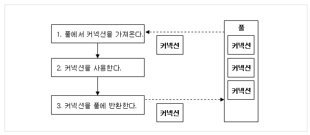
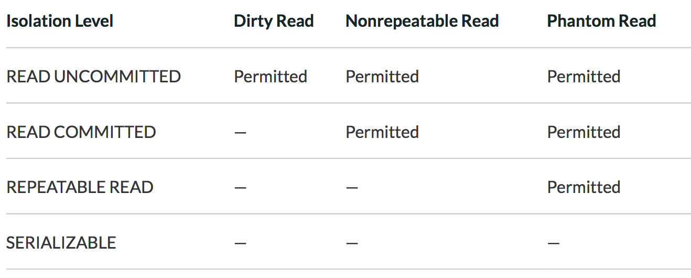

# 4.DataBase
**:radio_button: Contents**
* [데이터베이스 커넥션 풀](#데이터베이스-커넥션-풀)
* [정규화](#정규화)
* [Join](#Join)
* [트랜잭션(Transaction)](#Transaction)
* [인덱스(Index)](#Index)
* [옵티마이저(Optimizer)](#Optimizer)

-------

### 데이터베이스 커넥션 풀
> https://delf-lee.github.io/post/connection-pool/

* Connection pool
    * 클라이언트의 요청에 따라 각 어플리케이션의 스레드에서 데이터베이스에 접근하기 위해서는 Connection이 필요함
    * Connection pool은 이런 Connection 여러 개 생성해 두어 저장해 놓은 공간(캐시), 또는 이 공간의 Connection을 필요할 때 꺼내 쓰고 반환하는 기법을 말함.
    * example : Apache common DBCP , Tomcat-JDBC 등
    
    * **특징**
        * 매 연결마다 connection 객체를 생성하고 소멸시키는 비용을 줄임
        * 미리 생성된 connection 객체를 사용하기 때문에 DB 접근시간이 단축됨
        * DB 접근 connection 수를 제한하여, 메모리와 DB에 걸리는 부하를 조정할 수 있다.
    
* DB 접근 단계
    * 웹 컨테이너가 실행되면서 DB와 연결된 connecton 객체들을 미리 생성하여 pool에 저장함
    * DB에 요청하면, pool에서 connection 객체를 가져와 DB에 접근하고 처리가 끝나면 pool에 반환한다.
    
    
    
* connection이 부족할 경우
    * 모든 요청이 DB에 접근하고 있고, 남은 connection이 없으면, 해당 클라이언트는 대기 상태로 전환시키고, pool에 connection이 반환되면 순차적으로 대기 클라이언트에 제공됨.
    
* 비슷한 맥락으로 Thread pool이라는 개념도 있다.
    * 매 요청마다 요청을 처리할 Thread를 만드는 것이 아닌, 미리 생성한 pool 내의 Thread 를 소멸시키지 않고 재사용하여 효율적으로 자원을 활용하는 기법
    

********************

# 정규화
> http://asfirstalways.tistory.com/341
* 데이터베이스의 정규화란?
    * 데이터 베이스 정규화는 데이터베이스의 설계를 재구성하는 테크닉이다. 정규화를 통해 불필요한 데이터(redundancy)를 없앨 수 있고, 삽입/갱신/삭제 시 발생할 수 있는 각종 이상현상(Anamolies)를 방지할 수 있다.  
    * 갱신 이상에는 다음과 같은 예가 있다.
        * 1. 삽입이상(insertion anomalies) - 원하지 않는 자료의 삽입, 자료가 부족해 삽입이 되지 않아 문제 발생
        * 2. 삭제이상(deletion anomalies) - 하나의 자료만 삭제하고 싶지만, 그 자료가 포함된 튜플 전체가 삭제됨으로, 원하지 않는 정보 손실이 발생함
        * 3. 수정(갱신)이상(modification anomalies) - 정확하지 않거나 일부의 튜플만 갱신되어 정보가 모호해지거나 일관성이 없어짐.  
        
    * 데이터베이스 정규화의 목적은 주로 두가지이다.
        * 1. 불필요한 data redundancy의 제거
        * 2. 데이터 저장을 "논리적으로"하기 위해  
    
    * "나쁜" 릴레이션의 애트리뷰트들을 나누어 "좋은" 작은 릴레이션으로 분해하는 작업을하는 것이 정규화이다.
    
* 정규화의 법칙( Normalization rule) 
    * 제 1 정규형
        * 애트리뷰트의 도메인이 오직 원자값만을 포함하고, 튜플의 모든 애트리뷰트가 도메인에 속하는 하나의 값을 가져야 한다. 즉, 복합 애트리뷰트, 다중값 애트리뷰트, 중첩 릴레이션 등 비 원자적인 애트리뷰트들을 허용하지 않는 릴레이션 형태를 말한다.
    
    * 제 2 정규형
        * 모든 비주요 애트리뷰트들이 주요 애트리뷰트에 대해서 완전 함수적 종속이면 제 2 정규형을 만족한다고 볼 수 있다.
        * 완전 함수적 종속 : X->Y라고 가정했을 때, X의 어떠한 애트리뷰트라도 제거하면 더 이상 함수적 종속성이 성립하지 않는 경우를 말한다. 키가 아닌 열들이 각각 후보키에 대해 결정되는 릴레이션 형태를 말한다.
    
    * 제 3정규형 
        * 어떠한 비주요 애트리뷰트도 기본키에 대해 이행적으로 종속되지 않으면 제 3정규형을 만족한다.
        * 이행 함수적 종속 : X->Y, Y->Z의 경우 추론될 수 있는 X->Y의 종속관계를 말한다. 즉, 비주요 애트리뷰트가 비주요 애트리뷰트에 의해 종속되는 경우가 없는 릴레이션 형태를 말한다.
    
    * BCNF(Boyce-Codd) 정규형
        * 여러 후보 키가 존재하는 릴레이션에 해당하는 정규화 내용이다.
        * 복잡한 식별자 관계에 의해 발생하는 문제를 해결하기 위해 제 3정규형을 보완하고, 비주요 애트리뷰트가 후보키의 일부를 결정하는 함수적 종속성을 분해하는 과정이다.

* 제 1정규형, 제 2정규형, 제 3 정규형, BCNF 에 대한 구체적인 설명(예시)는 아래의 링크로 대신한다.

> https://yaboong.github.io/database/2018/03/09/database-normalization-1/  
> https://3months.tistory.com/193  

* 정규화의 장점
    * 1. 데이터베이스 변경 시 이상 현상(Anomaly) 제거
    * 2. 데이터베이스 구조 확장 시 재 디자인 최소화
        * 정규화된 데이터베이스 구조에서는 새로운 데이터 형의 추가로 인한 확장 시, 그 구조를 변경하지 않아도 되거나 일부만 변경해도 된다. 이느 ㄴ데이터베이스와 연동된 응용 프로그램에 최소한의 영향만을 미치게 되며, 응용 프로그램의 생명을 연장시킨다.
    * 3. 사용자에게 데이터 모델을 더욱 의미있게 제공 - 정규화된 테이블들과 정규화된 테이블들 간의 관계들은 현실 세계에서의 개념들과 그들관의 관계들을 반영한다.

********************

# Join
> https://doooyeon.github.io/2018/11/11/database-join.html

********************

# Transaction
> http://limkydev.tistory.com/100  
> https://coding-factory.tistory.com/226  
> http://hundredin.net/2012/07/26/isolation-level/  

* Transaction의 정의
Transaction은 데이터베이스의 상태를 변환시키는 하나의 논리적 기증을 수행하기 위한 작업의 단위, 또는 한꺼번에 모두 수행되어야 할 일련의 연산을 의미한다.  

    * 트랜잭션은 데이터베이스 시스템에서 병행제어 및 회복 작업 시 처리되는 작업의 논리적 단위이다.
    * 사용자가 시스템에 대한 서비스 요구 시 시스템이 응답하기 위한 상태 변환 과정의 작업단위이다.
    * 하나의 트랜잭션은 commit 되거나, Rollback 된다.  
    
* Transaction의 성질
    * Atomicity (원자성)
        * 트랜잭션의 연산은 데이터베이스에 모두 반영되든지 아니면 전혀 반영되지 않아야 한다.
        * 트랜잭션 내의 모든 명령은 반드시 완벽히 주행되어야 하며, 모두가 완벽히 수행되지 않고 어느 하나라도 오류가 발생하면 트랜잭션 전부가 취소되어야 한다.  
    
    * Consistency(일관성)
        * 트랜잭션이 그 실행을 성공적으로 완료하면 언제나 일관성 있는 데이터베이스 상태로 변환한다.
        * 시스템이 가지고 있는 고정요소는 트랜잭션 수행 전과 트랜잭션 수행 완료 후 의 상태가 같아야 한다.
    
    * Isolation(독립성, 격리성)
        * 둘 이상의 트랜잭션이 동시에 병행 실행되는 경우 어느 하나의 트랜잭션 실행중에 다른 트랜잭션의 연산이 끼어들 수 없다.
        * 수행중인 트랜잭션은 완전히 완료될 때가지 다른 트랜잭션에서 수행 결과를 참조할 수 없다.
    
    * Durability(영속성, 지속성)
        * 성공적으로 완료된 트랜잭션의 결과는 시스템이 고장나더라도 영구적으로 반영되어야 한다.
        

* 트랜잭션의 필요성
    * 현금 인출기를 작동하는 도중에 기계오류나 정전 등과 같은 예기치 않은 상황이 발생하여 카드가 나오지 않거나 기계가 멈추는 경우
    * 각각 다른 지점의 은행에서 동시에 인출할 때, 하나의 지점이 다른 지점에서 저장한 잔액을 덮어 쓰는 경우
    * 위와 같은 상황이 발생되지 않도록 방지하기 위해, 즉, 트랜잭션의 성질인 ACID를 제공받기위해 트랜잭션을 사용한다.  

* 트랜잭션 격리 수준
    * Isolation level 이란?
        * 트랜잭션에서 일관성이 없는 데이터를 허용하도록 하는 수준  

    * Isolation level의 필요성
        * 데이터베이스는 ACID 같이 트랜잭션이 원자적이면서도 독립적인 수행을 하도록 한다 --> Locking의 개념 등장
        * Locking이란, 트랜잭션이 DB를 다루는 동안 다른 트랜잭션이 관여하지 못하도록 막는것.
        * Isolation level이란 Locking을 하는 방법이다. 

    * Isolation Level의 종류
    1. Read Uncommitted
        * SELECT 문장을 수행하는 경우 해당 데이터에 shared lock이 걸리지 않는 level. 
        * 어떤 사용자가 A라는 데이터를 B라는 데이터로 변경하는 동안 다른 사용자는 B라는 아직 완료되지 않은(uncommitted) 데이터 B를 읽을 수 있다.  
    
    2. Read Committed
        * SQL Server가 Default로 사용하는 Isolation level로, SELECT 문장이 수행되는 동안 해당 데이터에 shared lock이 걸린다.
        * 어떠한 사용자가 A라는 데이터를 B라는 데이터로 변경하는 동안 다른 사용자는 해당 데이터에 접근할 수 없다.  
    
    3. Repeatable Read
        * 트랜잭션이 완료될 때까지 SELECT 문장이 사용하는 모든 데이터에 Shared lock이 걸리므로, 다른 사용자는 그 영역에 해당되는 데이터에 대한 수정이 불가능하다.  
    
    4. Serializable
        * 트랜잭션이 완료될 때까지 SELECT 문장이 사용하는 모든 데이터에 Shared Lock이 걸리므로 다른 사용자는 그 영역에 해당되는 데이터에 대한 수정 및 입력이 불가능하다.
        * Repeatable Read는 직접적으로 지목되지 않은 범위에 해당하는 ROW UPDATE가 가능하였지만, Serializable 레벨에서는 UPDATE 작업을 허용하지 않는다.
    
    * READ Uncommitted에서 Serializable 순으로 Concurrency는 높아지고, 속도는 높아진다.
    * 위 네가지 Isolation level 에 따라 발생하는 현상이 세가지 있는데 이는 Dirty Read, Repeatable Read, Phantom Read이다.
        
        * Dirty Read
            * 어떤 트랜잭션에서 아직 실행이 끝나지 않은 다른 트랜잭션에 의한 변경사항을 보게 되는 경우를 Dirty read라 한다. 만약 원래 트랜잭션에서 그 변경사항을 롤백하면 그 데이터를 읽은 트랜잭션은 dirty 데이터를 가지고 있다고 말한다.  
        
        * Repeatable Read 
            * 어떤 트랜잭션에서 같은 Query를 사용했을 때, Query를 여러번 해도, 또 다른 트랜잭션에서 아무리 여러번 그 행을 변경해도 항상 같은 데이터만 읽어내는 경우를 repeatable read라 한다.
            * Repeatable read가 요구되는 트랜잭션에서는 다른 트랜잭션에 의한 변경사항을 볼 수 없다. 변경사항을 보고 싶다면, 어플리케이션에서 트랜잭션을 새로 시작해야한다.  
        
        * Phantom read
            * 다른 트랜잭션에 의한 변경사항으로인해 현재 사용중인 트랜잭션의 WHERE 절의 조건에 맞는 새로운 행이 생길 수 있는 경우에 관한 것이다. 
            * 예를 들어 $100 미만인 계좌를 모두 찾아내는 트랜잭션이 있고, 이 트랜잭션에서 그 데이터를 두 번 읽는다고 가정했을 때, 처음 데이터를 읽어들이고 난 후에 다른 트랜잭션에서 잔고가 $0인 계좌를 새로 만들면 이 계좌도 잔고가 $ 100 이하라는 조건에 맞게 된다. 
            * Transaction Isolation Level에서 phantom read를 지원하면 새로운 "phantom 행"이 나오지만, 지원하지 않으면 새로 생긴 행을 볼 수 없다.

            

               
               
               

********************

# Index

> http://interconnection.tistory.com/97    
> http://asfirstalways.tistory.com/333  

* Index란?
    * 색인, DBMS 데이터베이스 테이블의 모든 데이터를 검색해서 원하는 결과를 가져오려면 시간이 오래걸리기 때문에, 칼럼의 값과 해당 레코드가 저장된 주소를 key/value로 인덱스를 만들어 두는 것이다.
    * DBMS의 인덱스는 항상 정렬된 상태를 유지하기 때문에 원하는 값을 탐색하는데는 빠르지만, 새로운 값의 추가, 삭제, 수정하는 경우에는 쿼리문 실행 속도가 느려진다.  ( 인덱스는 읽기 속도를 높이고, 저장성능은 희생하는 기능이다.)
    * "어떻게 하면 빠르게 정보를 검색, 제공해 줄수 있을까? " 의 해결책

* Index의 역할
    * 1. Primary Key 
        * 테이블 하나의 레코드를 데표하는 컬럼 값으로 만들어진 인덱스
        * 이 컬럼 값은 하나의 레코드를 식별할 수 있는 식별자로 불린다.
        * Null을 사용할 수 없고, 중복을 허용하지 않는다.  
  
    * 2. Secondary Key
        * primary key를 제외한 나머지 모든 인덱스를 Secondary Index라한다.
        * 보조 인덱스 키

* DBMS의 인덱스 관리 방식
    * B-Tree 인덱스 알고리즘
        * 가장 일반적으로 사용되는 인덱스 알고리즘
        * 컬럼 값을 변형하지 않고, 원래 값을 기준으로 이용하여 인덱싱하는 알고리즘  
    
    * Hash 인덱스
        * 컬럼값을 해시값으로 계산하여 인덱싱하는 알고리즘으로, 매우 빠른 속도로 지원한다.
        * 컬럼 값이 해시값으로 변형되어 인덱싱에 활용되기 때문에, 컬럼값의 일부분만 검색하고자 할때는 사용할 수 없다.
        * 주로 메모리 기반의 데이터베이스에서 많이 사용한다.(메모리 주소형태로 그 값을 모두 참조하는 형태로 사용)  
        
    * Fractal-Tree Index
        * B-Tree Index의 단점을 보완하기 위해 고안된 알고리즘으로, 컬럼 값을 변형하지 않고 인덱싱한다.
        * 데이터가 저장되거나 삭제될 때, 처리하는 비용을 줄일 수 있게 설계되어 B-Tree보다 경제적이다.
        * 아직 미성숙한 인덱싱 알고리즘.  

* 인덱스의 데이터의 중복 허용 여부
레코드의 인덱스 값이 중복되어서 사용하는 경우와 중복하지 않고 고유값을 가지고 있는 경우로 나뉜다.  

    * Unique Index (중복 불가능한 인덱스)
    * Non-Unique Index(중복 가능한 인덱스)

********************

# Optimizer
            

