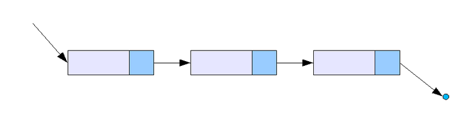
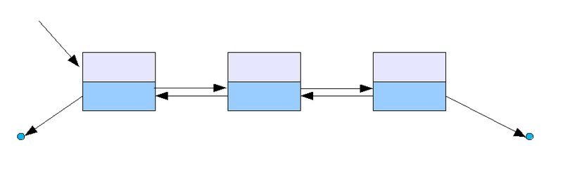
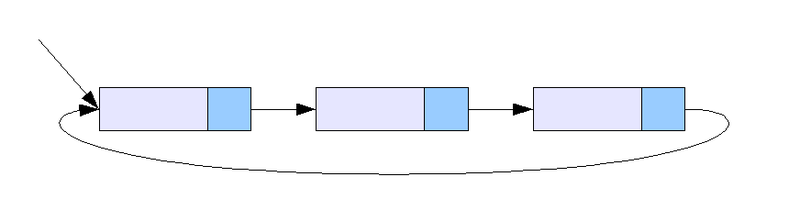

# 1.Data Structure
**:radio_button: Contents**
* [Array](#array)
* [LinkedList](#linkedlist)
* [HashTable](#hashtable)
* [Stack](#stack)
* [Queue](#queue)
* [Graph](#graph)
* [Tree](#tree)

### Array
* 배열(Array)의 개념
배열(array)은 같은 타입의 변수들로 이루어진 유한 집합으로 정의할 수 있다.
배열을 구성하는 각각의 값을 배열 요소(element)라고 하며, 배열에서의 위치를 가리키는 숫자를 인덱스(index)라고 한다.

*********

### LinkedList
* Linked List의 개념
연결리스트는 각 노드가 데이터와 포인터를 가지고 한 줄로 연결되어 있는 방식으로 데이터를 저장하는 자료 구조이다. 
선형배열이 "번호가 붙여진 칸에 원소들을 채워넣는 방식" 이라고 한다면, 연결리스트는 "각 원소들을 줄줄이 엮어서 관리하는 방식"이다.

  * 장점
     * 연결리스트는 원소들이 링크(link)로 연결되어 있고, 연결리스트의 가운데에서의 원소를 하나 삭제하거나, 혹은 가운데를 끊고 그 자리에 다른 원소를 (원소들을) 삽입하  는 것이 선형 배열의 경우보다 쉽다.(빠르다) 따라서, 원소의 삽입/삭제가 빈번히 일어나는 응용에서는 연결 리스트가 많이 이용된다.
  (자료의 추가와 삭제가 O(1)의 시간에 가능하다.)
  
  * 단점
     * 선형 배열에 비해서 데이터 구조 표현에 소요되는 메모리 소요가 크다. 
     * k 번째의 원소 를 찾아가는 데에는 선형 배열의 경우보다 시간이 오래 걸린다.선형 배열의 경우 원소들이 번호가 붙여진 칸들에 들어 있으므로 그 번호를 이용하여 특정   번째의 원소를 찾아갈 수 있지만, 연결 리스트에서는 특정 번째의 원소를 접근하려면 앞에서부터 하나씩 링크를 따라가면서 찾아가야 한다.
  (검색은 O(n)의 시간이 걸린다.)
  
* Linked List의 종류
  * 단일 연결 리스트
      * 단일 연결 리스트는 각 노드에 자료 공간과 한 개의 포인터 공간이 있고, 각 노드의 포인터는 다음 노드를 가리킨다.
      

  * 이중 연결 리스트
      * 이중 연결 리스트의 구조는 단일 연결 리스트와 비슷하지만, 포인터 공간이 두 개가 있고 각각의 포인터는 앞의 노드와 뒤의 노드를 가리킨다.
      
  
  * 원형 연결 리스트
      * 원형 연결 리스트는 일반적인 연결 리스트에 마지막 노드와 처음 노드를 연결시켜 원형으로 만든 구조이다.
      
  
      
*********
### HashTable
* Hash Table의 개념
해시 테이블(hash table), 해시 맵(hash map), 해시 표는 해시 함수를 사용하여 색인(index)을 버킷(bucket)이나 슬롯(slot)의 배열로 계산한다.

* Hash Table 용어 정리
   * collision - 서로 다른 입력값에 대해 동일한 해시값을 반환하는 것. 어떠한 해시함수든, 모든 입력 값에 대해 고유한 해시값을 만들어 내지는 못한다. 즉, collision은 피할 수 없다.
      * HashTable & collision resolution 
      > - [http://itstory.tk/entry/해슁에서의-충동해결Collision-Resolution](http://itstory.tk/entry/해슁에서의-충동해결Collision-Resolution)

   * cluster - 일부 지역의 주소들을 집중적으로 반환 하는 결과로 데이터들이 한 곳에 모이는 문제

* Hash Function
   * 해시 함수(hash function)는 임의의 길이의 데이터를 고정된 길이의 데이터로 매핑하는 함수이다.
   * 해시 함수는 큰 파일에서 중복되는 레코드를 찾을 수 있기 때문에 데이터베이스 검색이나 테이블 검색의 속도를 가속할 수 있다.
   * 해시 함수는 결정론적으로 작동해야 하며, 따라서 두 해시 값이 다르다면 그 해시값에 대한 원래 데이터도 달라야 한다. (역은 성립하지 않는다) 
   * 해시 함수의 질은 입력 영역에서의 해시 충돌 확률로 결정되는데, 해시 충돌의 확률이 높을수록 서로 다른 데이터를 구별하기 어려워지고 검색하는 비용이 증가하게 된다.
   *  같은 해시 값을 갖더라도 원래의 입력값이 같다는 것을 시사하지만 보장해주지는 않는다. 
   
*********
### Stack
* Stack의 개념
   * 한 쪽 끝에서만 자료를 넣고 뺄 수 있는 LIFO(Last In First Out) 형식의 자료 구조
* 스택(Stack)의 연산
   * size(): 현재 스택에 들어 있는 데이터 원소의 수를 구함
   * isEmpty(): 현재 스택이 비어 있는지를 판단 (size() == 0?)
   * push(x): 데이터 원소 x 를 스택에 추가
   * pop(): 스택에 가장 나중에 저장된 데이터 원소를 제거 (또한, 반환)
   * peek(): 스택에 가장 나중에 저장된 데이터 원소를 참조 (반환), 그러나 제거하지는 않음

* 스택(Stack)의 사용 사례 
   * 재귀 알고리즘 - 재귀 알고리즘을 쓸 때 스택을 쓰는 것이 유용하다.
   * 웹 브라우저 방문기록 (뒤로가기)
   * 실행 취소 (undo)
   * 역순 문자열 만들기
   * 수식의 괄호 검사 (연산자 우선순위 표현을 위한 괄호 검사)
   * 후위 표기법 계산
*********
### Queue
* Queue의 개념
  * 컴퓨터의 기본적인 자료 구조의 한가지로, 먼저 집어 넣은 데이터가 먼저 나오는 FIFO(First In First Out)구조로 저장하는 형식

* Queue의 연산
   * size(): 현재 큐에 들어 있는 데이터 원소의 수를 구함
   * isEmpty(): 현재 큐가 비어 있는지를 판단 (size() == 0?)
   * enqueue(item): 데이터 원소(item)를 큐에 넣는 동작
   * dequeue(): 큐로부터 데이터 원소를 꺼내는 동작
   * peek(): 큐에서 가장 위에 있는 원소를 참조 (반환), 제거는 하지 않음
   
* 큐(Queue)의 사용 사례 - 데이터가 입력된 시간 순서대로 처리해야 할 필요가 있는 상황에 이용
   * 너비 우선 탐색(BFS, Breadth-First Search) 구현
      * 노드를 하나 처리할 때마다 해당 노드와 인접한 노드들을 큐에 다시 저장한다. -> 노드를 접근한 순서대로 처리할 수 있다.
   * 캐시(Cache) 구현
   * 우선순위가 같은 작업 예약 (인쇄 대기열)
   * 선입선출이 필요한 대기열 (티켓 카운터)
   * 콜센터 고객 대기시간
   * 프린터의 출력 처리
   * 윈도우 시스템의 메시지 처리기
   * 프로세스 관리
*********
### Graph
> - [https://gmlwjd9405.github.io/2018/08/13/data-structure-graph.html](https://gmlwjd9405.github.io/2018/08/13/data-structure-graph.html)

* Graph의 개념
 * 연결되어 있는 객체 간의 관계를 표현하는 자료구조
 * 그래프 G는 (V,E)로 표시한다. (Vertex, Edge)
 * 그래프의 종류는 무방향 그래프, 방향 그래프, 가중치 그래프, 부분 그래프로 나눌수 있다.
    * 무방향 그래프
       * 무방향 간선만 사용
       * 간선을 통해 양방향 이동 가능
       * (A,B) = (B,A)
    * 방향 그래프
       * 방향 간선만 사용
       * 간선을 통해 한 쪽 방향으로만 이동 가능 ( 일방통행 )
       * <A, B> ≠ <B, A>
    * 가중치 그래프
       * 간선에 비용(cost)나 가중치(weight)가 할당된 그래프
    * 부분 그래프
       * 정점 집합 V(G)와 간선 집합 E(G)의 부분 집합으로 이루어진 그래프
 * 인접행렬과 인접리스트로 표현할 수 있다.
 
 
* Graph의 용어
   * 정점(vertex): 위치라는 개념. (node 라고도 부름)
   * 간선(edge): 위치 간의 관계. 즉, 노드를 연결하는 선 (link, branch 라고도 부름)
   * 인접 정점(adjacent vertex): 간선에 의 해 직접 연결된 정점
   * 정점의 차수(degree): 무방향 그래프에서 하나의 정점에 인접한 정점의 수
   * 경로 길이(path length): 경로를 구성하는 데 사용된 간선의 수
   * 단순 경로(simple path): 경로 중에서 반복되는 정점이 없는 경우
   * 사이클(cycle): 단순 경로의 시작 정점과 종료 정점이 동일한 경우
 
* Graph의 특징
   * 그래프는 네트워크 모델 이다.
   * 2개 이상의 경로가 가능하다.
   * self-loop 뿐 아니라 loop/circuit 모두 가능하다.
   * 루트 노드라는 개념이 없다.
   * 부모-자식 관계라는 개념이 없다.
   * 순회는 DFS나 BFS로 이루어진다.
   * 그래프는 순환(Cyclic) 혹은 비순환(Acyclic)이다.
   * 그래프는 크게 방향 그래프와 무방향 그래프가 있다.
   * 간선의 유무는 그래프에 따라 다르다.
   
* Graph의 탐색
   * 깊이 우선 탐색( DFS )
      * 루트노드에서 시작하여 다음 branch로 넘어가기 전 해당 branch를 완벽하게 조사하는 것
      * 모든 노드를 방문하고자 할 때 이 방법을 선택한다. - DFS가 BFS보다 간편
      
      
   * 넓이 우선 탐색 ( BFS )
      * 루트 노드에서 시작해서 인접한 노드를 먼저 탐색하는 방법
      * 두 노드 사이의 최단 경로 혹은 임의의 경로를 찾고 싶을 때 이 방법을 선택한다.
      
   
   * DFS, BFS에 대한 자세한 내용은 알고리즘 파트에서 다루기로 한다.

*********
### Tree
*********

