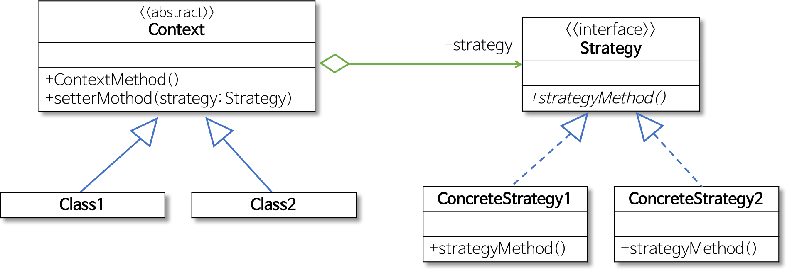

# 5.Design Pattern
**:radio_button: Contents**
* [디자인 패턴의 개념](#DesignPattern)
* [Singleton 패턴](#Singleton-패턴)
* [Strategy 패턴](#Strategy-패턴)
* [Template Method 패턴](#Template-Method-패턴)
* [Factory Method 패턴](#Factory-Method-패턴)
* [MVC 패턴](#MVC-패턴)
* [MVP 패턴](#MVP-패턴)
* [MVVM 패턴](#MVVM-패턴)

*********

# DesignPattern
> https://gmlwjd9405.github.io/2018/07/06/design-pattern.html
> https://zeddios.tistory.com/587

* 디자인 패턴이란?
    * 전체 구조를 손상시키지 않으면서, 주어진 상황에서 일반적으로 발생하는 문제애 대한 일반적인 재사용 가능한 솔루션. --> 특정 문제를 해결하는데에 도움이 되는 패턴(소프트웨어 개발방법을 공식화한 것)
    * 패턴이란
        * 각기 다른 소프트웨어 모듈이나 기능을 가진 다양한 응용 소프트웨어 시스템들을 개발할 때도 서로 간에 공통되는 설계 문제가 존재하며 이를 처리하는 해결책 사이에도 공통점이 있다. 이러한 유사점을 패턴이라 한다.
        * 패턴은 공통의 언어를 만들어주며 팀원 사이의 의사 소통을 원활하게 해주는 아주 중요한 역할을 한다.

> 패러다임 : 프로그래밍의 원칙, 과정, 프로그램이 만들어지는 방식을 설명해 놓은 것.  
> 프로그래밍 패러다임은 프로그래머에 프로그래밍 관점을 갖게 해주고 결정하는 역할을 한다. 예를 들어 객체 지향 프로그래밍은 프로그래머들이 프로그램을 상호작용하는 객체들의 집합으로 볼 수 있게 하는 반면, 함수형 프로그래밍은 상태값을 지니지 않는 함수값들의 연속으로 생각할 수 있게 해준다. 

* GOF 디자인 패턴

    
    
    * 1. 생성 패턴(Creational Pattern)
        * 객체 생성에 관련된 패턴
        * 객체의 생성과 조합을 캡슐화해 특정 객체가 생성되거나 변경되어도 프로그램 구조에 영향을 크게 받지 않도록 유연성을 제공한다.
    
    * 2. 구조 패턴(Structural Pattern)
        * 클래스나 객체를 조합해 더 큰 구조를 만드는 패턴
        * 예를 들어 서로 다른 인터페이스를 지닌 2개의 객체를 묶어 단일 인터페이스를 제공하거나 객체들을 서로 묶어 새로운 기능을 제공하는 패턴이다.
    
    * 3. 행위 패턴(Behavioral Pattern)
        * 객체나 클래스 사이의 알고리즘이나 책임 분배에 관련된 패턴
        * 한 객체가 혼자 수행할 수 없는 작업을 여러 개의 객체로 어떻게 분배하는지, 또 그렇게 하면서도 객체 사이의 결합도를 최소화하는 것에 중점을 둔다.
*********

# Singleton 패턴
> http://jeong-pro.tistory.com/86
* 싱글톤 패턴이란?
    * 싱글톤 패턴을 통해 하나의 인스턴스만을 생성하고 사용할 수 있다. --> 하나의 객체만 생성하고 사용해야 할 때, 적용할 수 있는 패턴
    * 전역 변수를 사용하지 않고 객체를 하나만 생성 하도록 하며, 생성된 객체를 어디에서든지 참조할 수 있도록 하는 패턴이다.  
    
    

* 싱글톤 패턴의 사용
    * 하나의 인스턴스만을 생성하는 책임이 있으며 getInstance 메서드를 통해 모든 클라이언트에게 동일한 인스턴스를 반환하는 작업을 수행한다.
    * 고정된 메모리 영역을 얻으면서 한번의 객체 생성이 이루어지기 때문에, 메모리 낭비를 방지할 수 있다.
    * DataBase Connection Pool 처럼, 공통된 객체를 여러개 생성해서 사용해야하는 상황에서 많이 사용한다. ( Thread Pool, Cache, 사용자 설정, 레지스트리 설정, 로그 기록 객체 등)

* 주의할 점
    * 싱글톤 인스턴스가 너무 많은 일을 하거나, 많은 데이터를 공유시킬 경우 다른 클래스의 인스턴스들 간의 결합도가 높아져 객체 지향 설계 원칙에 어긋나게될 수 있다. ( 수정이 어렵고, 테스트가 어렵다.)
    * 멀티 쓰레드 환경에서 동기화처리가 필수적이다.   

*********

# Strategy 패턴
> https://gmlwjd9405.github.io/2018/07/06/strategy-pattern.html

* Strategy 패턴이란?
    * 행위를 클래스로 캡슐화해 동적으로 행위를 자유롭게 바꿀수 있게 해주는 패턴
        * 같은 문제를 해결하는 여러 알고리즘이 클래스별로 캡슐화 되어 있고, 이들이 필요할 때 교체할 수 있도록 함으로써 동일한 문제를 다른 알고리즘으로 해결할 수 있게 하는 디자인 패턴
    * ' 전략을 쉽게 바꿀 수 있도록 해주는 디자인 패턴'
        * 전략이란? - "문제를 해결하는 알고리즘". 
    
    * 게임 프로그래밍에서 게임 캐릭터가 자신이 처한 상황에 따라 공격이나 행동하는 방식을 바꾸고 싶을 때 strategy pattern은 유용하다.
    
        
        
        

* 수행하는 작업
    * Strategy
        * 인터페이스나 추상클래스로 외부에서 동일한 방식으로 알고리즘을 호출하는 방법을 명시
    * ConcreteStrategy
        * 스트래티지 패턴에서 명시한 알고리즘을 실제로 구현하는 클래스
    * Context
        * Strategy pattern을 이용하는 역할을 수행한다.
        * 필요에 따라 동적으로 구체적인 전략을 바꿀 수 있도록 setter 메서드를 제공한다.

*********

# Template Method 패턴
> https://gmlwjd9405.github.io/2018/07/13/template-method-pattern.html
* Template Method 패턴이란?
    * 어떤 작업을 처리하는 일부분을 서브클래스로 캡슐화해 전체 일을 수행하는 구조는 바꾸지 않으면서 특정 단계에서 수행하는 내역을 바꾸는 패턴
        * 전체적으로는 동일하지만, 부분적으로 다른 구문으로 구성된 메서드의 코드 중복을 최소화할 때 유용하다.
        * 동일한 기능을 상위클래스에서 정의하면서 확장/변화가 필요한 부분만 서브클래스에서 구현할 수 있도록 한다.
        * ex) 전체적인 알고리즘은 상위 클래스에서 구현하면서, 다른 부분은 하위 클래스에서 구현할 수 있도록 함으로써 전체적인 알고리즘 코드를 재사용하는 데에 유용하도록 한다.
        
    
    
    

* 수행하는 작업
    * AbstractClass
        * 템플릿 메서드를 정의하는 클래스
        * 하위 클래스에 공통 알고리즘을 정의하고 하위 클래스에서 구현될 기능을 primitive 메서드 또는 hook 메서드로 정의하는 클래스
    * ConcreteClass
        * 물려받은 primitive 메서드 또는 hook 메서드를 구현하는 클래스
        * 상위 클래스에 구현된 템플릿 메서드의 일반적인 알고리즘에서 하위 클래스에 적합하게 primitive 메서드나 hook 메서드를 오버라이드 하는 클래스

*********

# Factory Method 패턴
> https://gmlwjd9405.github.io/2018/08/07/factory-method-pattern.html
* Factory Method 패턴이란?
    * 객체 생성 처리를 서브 클래스로 분리 해 처리하도록 캡슐화하는 패턴
        * 객체의 생성 코드를 별도의 클래스/메서드로 분리함으로써 객체 생성의 변화에 대비하는 데 유용하다.
        * 특정 기능의 구현은 개별 클래스를 통해 제공되는 것이 바람직한 설계이다.
            * 기능의 변경이나 상황에 따른 기능의 선택은 해당 객체를 생성하는 코드의 변경을 초래한다.
            * 상황에 따라 적절한 객체를 생성하는 코드는 자주 중복될 수 있다.
            * 객체 생성 방식의 변화는 해당되는 모든 코드 부분을 변경해야 하는 문제가 발생한다.
        * Strategy Pattern, Single pattern, Template Method pattern을 사용한다.
    
    
    
* 수행하는 작업
    * Product
        * 팩토리 메서드로 생성될 객체의 공통 인터페이스
    * ConcreteProduct
        * 구체적으로 객체가 생성되는 클래스
    * Creator
        * 팩토리 메서드를 갖는 클래스
    * ConcreteCreator
        * 팩토리 메서드를 구현하는 클래스로 ConcreteProduct 객체를 생성
        
*********

# MVC 패턴
> https://opentutorials.org/course/697/3828
> http://ha0programming.tistory.com/23

* MVC 패턴
    * Model, View, Controller 의 각각의 약자로 어플리케이션을 세가지의 역할로 구분한 개발 방법론. 사용자가 Controller를 조작하면 Controller는 Model을 통해 데이터를 가져오고, 그 정보를 바탕으로 시각적인 표현을 담당하는 View를 제어하여 사용자에게 전달한다.
    
    * Model : 백그라운드에서 동작하는 로직을 처리한다.
    * View : 사용자가 보게 될 결과 화면을 출력한다.
    * Controller : 사용자의 입력처리와 흐름 제어를 담당한다.
        
    
    
    * Web 과 MVC
        * 1. 사용자가 웹사이트에 접속한다.(Uses)
        * 2. Controller가 사용자가 요청한 웹페이지를 서비스하기위해 model을 호출한다.(Manipulates)
        * 3. 모델은 데이터베이스나 파일과 같은 데이터 소스를 제어한 후에 그 결과를 리턴한다.
        * 4. Controller는 Model이 리턴한 결과를 View에 반영한다. (Updates)
        * 5. 데이터가 반영된 View는 사용자에게 보여진다. (Sees)
        
        

* MVC 패턴의 장점
    * 유연하고 확장하기가 쉽다. : View와 model 간의 간섭을 피하고, Controller가 중간 관리를 하는 역할을 하여 간접 소통을 통해 좀더 유연한 구조를 설계할 수 있다.
    * 디자이너와 개발자의 협업이 용이하다.
    
* MVC 패턴의 단점
    * 기본 기능 설계를 위해 클래스들이 많이 필요하기 때문에 복잡할 수 있다.
    * 설계 시간이 오래걸리고, 숙련된 개발자가 필요하다.
    * 모델과 view의 완벽한 분리가 어렵다. - 패턴이 모호해질 수 있고, 변형이 올 수 있다.
    
> 의존성이 높다 ? : View와 Model의 높은 의존성은 어플리케이션이 커질수록 복잡해지고, 유지보수를 어렵게 만든다. 
#
* MVC1 패턴과 MVC2 패턴의 차이점
    * Model 1 방식과 Model 2 방식의 가장 큰 차이점은 진입 부분이다.
    * model 1
        * 가장 먼저 JSP 에 들어오고, JSP에서 비즈니스 로직 및 VIEW를 처리한다.
        * 비즈니스 로직, VIEW 화면출력 모두 JSP 에서 처리한다.
    
    
    
    * model 2
        * 가장 먼저 요청하는 곳이 서브릿단으로, 비즈니스 로직을 처리하는 서블릿을 완전히 분리 시켜 VIEW 단과 로직을 처리하는 단을 분리시킨다.
        * 서블릿단에서 비즈니스 로직, JSP에서 VIEW단을 처리한다.
        
    

*********
# MVP 패턴
> https://magi82.github.io/android-mvc-mvp-mvvm/

* MVP 패턴 개념
    * Model View Presenter로 구성되어있다. MVC의 Controller 대신 presenter가 존재한다.
    * presenter : view에서 요청한 정보를 model로 부터 가공해서 view로 전달하는 부분이다.  

* MVP 패턴의 특징    
    * Model과 View는 MVC와 동일하지만 사용자의 입력은 View에서 받는다.(MVC에서는 Controller)
    * Model과 View는 각각 Presenter와 상호 동작을한다. ( 항상 presenter를 거쳐서 동작함.)
    * MVC의 단점인 View와 Model의 의존성이 없어지게 된다.
    * View와 Model의 의존성이 없는 대신 View와 Presenter가 1:1로 강한 의존성을 지닌다.
    
* MVP패턴 동작 순서
    1. View로 사용자의 입력이 들어온다.
    2. View는 presenter에 작업요청을 한다.
    3. Presenter에서 필요한 데이터를 Model에 요청한다.
    4. Model은 Presenter에 필요한 데이터를 응답한다.
    5. Presenter는 View에 데이터를 응답한다.
    6. View는 Presenter로 부터 받은 데이터로 화면에 보여주게 된다.
    
    
*********
# MVVM 패턴
> https://magi82.github.io/android-mvc-mvp-mvvm/  
> 보다 자세한내용은 https://github.com/fimuxd/RxSwift/blob/master/Lectures/23_MVVM%20with%20RxSwift/Ch.23%20MVVM%20with%20RxSwift.md

* MVVM 패턴 개념
    * MVP의 Presenter 대신 Viewmodel이 존재한다.
    * ViewModel : View를 표현하기 위해 만들어진 View를 위한 Model  
    

* MVVM 패턴의 특징  
    * Command 패턴과 DataBinding 패턴을 이용하여 View와 Viewmodel의 의존성을 사라지게 한다.
    * MVP와 마찬가지로 View에서 입력이 들어오고, 입력이 들어오면 Command pattern을 통해 ViewModel에 명령을 내리게 되고,  Data Binding으로 인해 ViewModel 값이 변화하면 바로 View의 정보가 바뀐다.

* MVVM패턴 동작 순서
    1. View에 입력이 들어오면 Command pattern으로 ViewModel에 명령을 한다.
    2. ViewModel은 필요한 데이터를 Model에 요청한다.
    3. Model은 ViewModel에 필요한 데이터를 응답한다.
    4. ViewModel은 응답받은 데이터를 가공해서 저장한다.
    5. View는 ViewModel과의 Data Binding으로 인해 자동으로 갱신된다.
    
> Command Pattern : 요청을 객체로 캡슐화하여 명령을 단순화한다. (요청과 수행에 있어 분리하여 느슨한 관계를 가진다.)   
>http://minsone.github.io/programming/designpattern-command  
> Data Binding : model과 view의 데이터를 일치시키는 것  
>https://sungjk.github.io/2015/11/22/AngularJS(2).html

