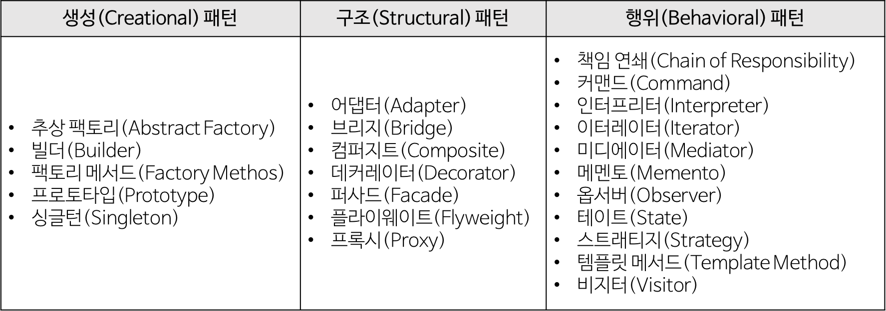

# 5.Design Pattern
**:radio_button: Contents**
* [디자인 패턴의 개념](#DesignPattern)
* [Singleton 패턴](#Singleton-패턴)
* [Strategy 패턴](#Strategy-패턴)
* [Template Method 패턴](#Template-Method-패턴)
* [Factory Method 패턴](#Factory-Method-패턴)
* [MVC1 패턴과 MVC2 패턴](#MVC1-패턴과-MVC2-패턴)
* [MVVM 패턴](#MVVM-패턴)

*********

# DesignPattern
> https://gmlwjd9405.github.io/2018/07/06/design-pattern.html
> https://zeddios.tistory.com/587

* 디자인 패턴이란?
    * 전체 구조를 손상시키지 않으면서, 주어진 상황에서 일반적으로 발생하는 문제애 대한 일반적인 재사용 가능한 솔루션. --> 특정 문제를 해결하는데에 도움이 되는 패턴(소프트웨어 개발방법을 공식화한 것)
    * 패턴이란
        * 각기 다른 소프트웨어 모듈이나 기능을 가진 다양한 응용 소프트웨어 시스템들을 개발할 때도 서로 간에 공통되는 설계 문제가 존재하며 이를 처리하는 해결책 사이에도 공통점이 있다. 이러한 유사점을 패턴이라 한다.
        * 패턴은 공통의 언어를 만들어주며 팀원 사이의 의사 소통을 원활하게 해주는 아주 중요한 역할을 한다.

> 패러다임 : 프로그래밍의 원칙, 과정, 프로그램이 만들어지는 방식을 설명해 놓은 것.  
> 프로그래밍 패러다임은 프로그래머에 프로그래밍 관점을 갖게 해주고 결정하는 역할을 한다. 예를 들어 객체 지향 프로그래밍은 프로그래머들이 프로그램을 상호작용하는 객체들의 집합으로 볼 수 있게 하는 반면, 함수형 프로그래밍은 상태값을 지니지 않는 함수값들의 연속으로 생각할 수 있게 해준다. 

* GOF 디자인 패턴

    
    
    * 1. 생성 패턴(Creational Pattern)
        * 객체 생성에 관련된 패턴
        * 객체의 생성과 조합을 캡슐화해 특정 객체가 생성되거나 변경되어도 프로그램 구조에 영향을 크게 받지 않도록 유연성을 제공한다.
    
    * 2. 구조 패턴(Structural Pattern)
        * 클래스나 객체를 조합해 더 큰 구조를 만드는 패턴
        * 예를 들어 서로 다른 인터페이스를 지닌 2개의 객체를 묶어 단일 인터페이스를 제공하거나 객체들을 서로 묶어 새로운 기능을 제공하는 패턴이다.
    
    * 3. 행위 패턴(Behavioral Pattern)
        * 객체나 클래스 사이의 알고리즘이나 책임 분배에 관련된 패턴
        * 한 객체가 혼자 수행할 수 없는 작업을 여러 개의 객체로 어떻게 분배하는지, 또 그렇게 하면서도 객체 사이의 결합도를 최소화하는 것에 중점을 둔다.
*********

# Singleton 패턴

*********

# Strategy 패턴

*********

# Template Method 패턴

*********

# Factory Method 패턴

*********

# MVC1 패턴과 MVC2 패턴

*********

# MVVM 패턴

