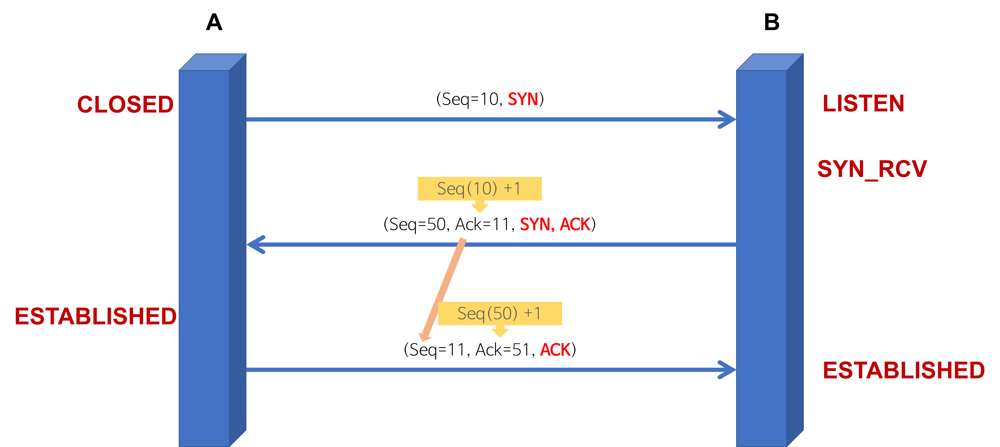

# 2.Network
**:radio_button: Contents**
* [OSI 7계층](#osi-7계층)
* [TCP와 UDP](#tcp와-udp)
  * TCP
    * TCP의 3 way handshake와 4 way handshake
  * UDP
  * TCP와 UDP의 비교
  * TCP와 UDP의 헤더
* [GET 메서드와 POST 메서드](#get-메서드와-post-메서드)
* [쿠키(Cookie)와 세션(Session)](#쿠키와-세션)
* [REST와 RESTful의 개념](#rest와-restful의-개념)

*********
# OSI 7계층
* OSI 7계층이란?
  * OSI 7 계층은 네트워크에서 통신이 일어나는 과정을 7단계로 나눈 것을 말한다. 
  * 통신이 일어나는 과정을 단계별로 파악할 수 있다. (한눈에 알아보기 쉽다. & easy for troubleshooting the network problems)
  
   

* OSI 7계층 단계
  
  * #### 1. Physical Layer
    * 전기적, 기계적 기능적 특성을 이용하여 통신 케이블로 데이터를 전송함
    * 통신단위는 비트이며, 1과 0, 즉 전기적으로 On / Off를 나타낸다
    * physical layer에서는 데이터를 전송만 할뿐, 그 데이턱 무엇인지, 어떤 에러가 있는지는 신경쓰지 않는다.
    * 통신장비, 리피터, 허브 등
    #
  
  * #### 2. DataLink Layer
    * 물리계층을 통해 송수신되는 정보의 오류와 흐름을 관리 -> 안전한 정보의 전달을 도와줌
    * DataLink Layer에서는 맥 주소를 통해 통신함. 전송되는 단위는 프레임이다.( 브리지나 스위치를 통해 맥주소를 가지고 물리계층에서 받은 정보를 전달 )
    * DataLink Layer에서는 point to point 간 신뢰성 있는 전송을 보장하기 위한 계층으로 CRC 기반의 오류 제어와 흐름 제어가 필요
    * 주소 값은 물리적으로 할당 받는다. 이는 네트워크 카드가 만들어질 때부터 맥 주소(MAC address)가 정해져 있다는 뜻 ( 프레임에 주소부여(MAC - 물리적주소))
    * 에러검출/재전송/흐름제어의 역할을 한다
    * 이더넷이 대표적인 DataLink Layer의 예
    #
    
  * #### 3. Network Layer
    * 데이터를 목적지까지 가장 안전하고 빠르게 전달하는 것이 Network Layer의 주요 기능이다. (라우팅)
    * Network Layer 에서는 경로를 선택하고 주소를 정하고 경로에 따라 패킷을 전달해주는 역할을 한다. --> 여러개의 노드를 거칠 때 마다 경로를 찾아주는 역할을 
      하는 계층으로, 데이터를 네트워크들을 통하여 전달하고, 그 과정에서 전송 계층이 요구하는 서비스 품질(QoS)을 제공하기 위한 기능적, 절차적 수단을 제공한다.
    * 네트워크 계층은 라우팅, 흐름 제어, 세그멘테이션(segmentation/desegmentation), 오류 제어, 인터네트워킹(Internetworking) 등을 수행한다. 
    * 논리적인 주소 구조(IP), 곧 네트워크 관리자가 직접 주소를 할당하는 구조를 가지며, 계층적(hierarchical)이다.
    #
    
  * 3.1 IP 계층
    * TCP/IP 상에서 IP 계층이란 네트워크의 주소 (IP 주소)를 정의하고, IP 패킷의 전달 및 라우팅을 담당하는 계층 ( 패킷을 목적지까지 전달하는 역할 )
    * 주요역할 : IP 계층에서는 그 하위계층인 데이터링크 계층의 하드웨어적인 특성에 관계없이 독립적인 역할을 수행함
    * IP 계층 상에 있는 주요 프로토콜
        * IP - 패킷의 전달을 책임짐
        * ICMP - 패킷 전달 에러의 보고 및 진단
        * 라우팅 프로토콜 - 복잡한 네트워크에서 인터 네트워킹을 위한 경로를 찾아줌

  
  * 3.2 IP 프로토콜
    * TCP/IP 기반의 인터넷 망을 통하여 데이터그램의 전달을 담당하는 프로토콜
    * 주요 기능 - IP 계층에서 IP 패킷의 라우팅 대상이 됨(Routing), IP 주소 지정(Addressing)
    * 주요 특징
        * Best-Effort Service ( 신뢰성(에러제어) 및 흐름제어 기능이 없음 )
        * Connectionless ( 비연결성 데이터그램 방식으로 전달되는 프로토콜 )
        * Unreliable ( 패킷의 완전한 전달을 보장하지 않음 ( 소실, 중복, 지연, 순서바뀜 등))
        * IPv4 헤더, IPv6 헤더, IP 주소 등 IP 패킷 헤더 내 수신 및 발신 주소를 포함함
        * Big-endian ( IP 헤더 내 바이트의 전달은 최상위 바이트(MSB)를 먼저 보냄)
        * TCP, UDP, ICMP, IGMP 등이 IP 데이터그램에 실려 전송됨

  #
  * #### 4. Transport Layer
    * 통신을 활성화하기 위한 계층, 보통 TCP 프로토콜을 이용함
    * Transport layer은 양 끝단(End to end)의 사용자들이 신뢰성 있는 데이터를 주고 받을 수 있도록 하여 상위 계층들이 데이터 전달의 유효성이나 효율성을 생각하지 않도록 한다.
    * 시퀀스 넘버 기반의 오류 제어 방식을 사용한다.
    * 전송 계층은 특정 연결의 유효성을 제어하고, 일부 프로토콜은 상태 개념이 있으며(stateful), 연결기반(connection oriented)이다. --> 전송 계층이 패킷들의 전송이 유효한지 확인하고, 전송 실패한 패킷들을 다시 전송한다.
    * 종단간 통신을 다루는 최하위 계층으로, 종단간 신뢰성 있고 효율적인 데이터를 전송하며, 오류 검출 및 복구와 흐름제어, 중복겁사 등을 수행한다.
    
    * 패킷생성(Assembly/Sequencing/Deassembly/Error detection/ Request repeat/ Flow control) 및 전송을 담당하는 계층이다./
    #
    * 4.1 TCP 프로토콜 ( Transmission control protocol )
        * 양종단 호스트 내 프로세스 상호 간 신뢰적인 연결 지향성 서비스를 제공
        * IP의 비신뢰적인 최선형 서비스에 신뢰적 연결지향성 서비스를 제공함 -> 신뢰적인 전송을 보장
        
        * 1. 신뢰성 있음(Reliable)
            * 패킷 손실, 중복, 순서바뀜 등이 없도록 보장
            * TCP 하위계층인 IP 계층의 신뢰성 없는 서비스에 대해 다방면으로 신뢰성 제공
        
        * 2. 연결 지향적 (Connection-oriented)
            * 같은 전송계층의 UDP가 비연결성(connectionless)인 것과는 달리 TCP는 연결지향적
            * 연결 관리를 위한 연결설정 및 연결해제 필요 
            * 양단간 어플리케이션과 프로세스는 TCP가 제공하는 연결성 회선을 통해 서로 통신한다.
    
    * 4.2 UDP 프로토콜 ( User Datagram Protocol )
        * 신뢰성이 낮은 프로토콜로써 완전성을 보증하지는 않지만, 가상회선을 확립할 필요 없고, 유연하며 효율적 응용의 데이터 전송에 사용됨
        
        * 1. 비연결성이고, 신뢰성이 없으며, 순서화되지 않은 Datagram 서비스 제공
            * 메세지가 제대로 도착했는지 확인하지 않음 ( 확인 응답 없음 )
            * 수신된 메세지의 순서를 맞추지 않음 ( 순서 제어 없음 )
            * 흐름 제어를 위한 피드백을 제공하지 않음 ( 흐름 제어 없음 )
            * 검사합을 제외한 특별한 오류 및 제어 없음 ( 오류 제어 거의 없음 )
            * UDP를 사용하는 프로그램 쪽에서 오류 제어 기능을 스스로 갖추어야함
            * 데이터 그램 지향의 전송계층용 프로토콜 ( 가상회선 연결 필요 없음 )
        
        * 2. 실시간 응용 및 멀티캐스팅 가능
            * 빠른 요청과 응답이 필요한 실시간 응용에 적합
            * 여러 다수 지점에 전송 가능 (1 대 다)
        
        * 3. 헤더가 단순함
            * UDP는 TCP처럼 16비트의 포트번호를 사용하지만 헤더는 고정크기의 8바이트(TCP는 20바이트) 만 사용한다 ( 헤더 처리에 많은 시간과 노력이 필요하지 않다.)

  #
    * #### 5. Session Layer
        * 데이터가 통신하기 위한 논리적인 연결을 하는 계층  - 4계층과 무관하게 응용프로그램의 관점에서 봄 ( 세션 설정, 유지, 종료, 전송 중단시 복구 등의 기능)
        * 양 끝단의 응용 프로세스가 통신을 관리하기 위한 방법을 제공한다.
        * duplex( 동시 송수신 방식 ), half-duplex( 반이중 방식 ), full duplex( 전이중 방식 )의 통신과 함께, 체크 포인팅과 유휴, 종료, 다시시작 과정등을 수행한다
        * Session Layer에서는 TCP/IP 세션을 만들고 없애는 책임을 진다.
        * 통신하는 사용자들을 동기화 하고 오류 복구 명령들을 일괄적으로 다룬다. 통신을 하기 위한 세션을 확립, 유지, 중단

   #
     * #### 6. Presentation Layer
        * 데이터 표현이 상이한 응용프로세스의 독립성을 제공하고 암호화 한다.
        * Presentation Layer은 코드 간의 번역을 담당하여 사용자 시스템에서 데이터의 형식상 차이를 다루는 부담을 응용계층으로 부터 덜어준다. MIME 인코딩, 암호화 등의 동작이 이 계층에서 이루어진다.
        * EX) EBCEIC로 인코딩된 문서 파일을 ASCII로 인코딩된 파일로 바꿔주는 것, 데이터가 TEXT인지 그림인지, GIF, JPG 인지의 구분 등이 presentation layer의 몫이다.

   #
    * #### 7. Application Layer
        * 최종 목적지로, HTTP, FTP, SMTP, POP3, IMAP, Telnet과 같은 프로토콜이 있다.
        * 해당 통신 패킷들은 위의 프로토콜에 의해 모두 처리되며, 인터넷 브라우저나, 메일 프로그램등은 프로토콜을 보다 쉽게 사용하게 해주는 응용프로그램이다. 
        * Application layer은 응용 프로세스와 직접 관계하여 일반적인 응용 서비스를 수행한다.

   #
     * 7.1 HTTP 프로토콜 ( HyperText Transfer Protocol )
        * 웹 상에서 웹 서버 및 웹 브라우저 상호간의 데이터 전송을 위한 응용계층 프로토콜
        
        * 1. 요청 및 응답의 구조 
            * 동작 형태가 클라이언트 / 서버 모델로 동작
       
       * 2. 메세지 교환 형태의 프로토콜
            * 클라이언트와 서버 간에 'HTTP 메세지' 를 주고 받으며 통신. SMTP 전자 메일 프로토콜과 유사
            * HTTP의 응답 및 요청 메세지 구성
            * HTTP 메세지 내 헤더 항목들
       
       * 3. 트랜잭션 중심의 비연결성 프로토콜
            * 종단간 연결이 없음 ( Connectionless )
            * 이전의 상태를 유지하지 않음 ( Stateless )
       
        * 4. 전송계층 프로토콜 및 사용 포트 번호
            * 전송 계층 프로토콜 : TCP
            * 사용 포토 번호 : 80번
        
        * 5. http 표준 
            * HTTP 헤더 내 Host 필드를 필수 항목으로 함 ( 1개 IP 주소에 다수의 가상 호스팅 가능 )
            * HTTP 헤더 내 Accept 필드에 의한 컨텐츠 협상
            * 잘 정의된 캐시 컨트롤
            * 블록 다누이 인코딩 전송
            * 지속 연결 회선 (keep alive connection)을 통한 재사용 가능
            
*********
# TCP와 UDP
* 네트워크 계층 중 Transport Layer 에서 사용하는 프로토콜
* #### 1.TCP
    * 인터넷상에서 데이터를 메세지의 형태로 보내기 위해 IP와 함께 사용하는 프로토콜
    
      
     
     * TCP의 특징
        * 연결형 서비스로 가상 회선 방식을 제공한다
            -> 발신지와 수신지를 연결하여 패킷을 전송하기 위한 논리적 경로를 배정한다.
        * 3-way handshaking 과정을 통해 연결을 설정하고, 4-way handshaking을 통해 해제한다.
            -> 3-way handshaking : 목적지와 수신지를 확실히 하여 정확한 전송을 보장하기 위해 세션을 수립하는 과정 
        * 흐름 제어 및 혼잡 제어
        * 높은 신뢰성을 보장한다.
        * UDP보다 속도가 느리다
        * 전이중 ( Full-Duplex), 점대점 ( Point to point ) 방식
        * TCP는 **연속성 보다 신뢰성 있는 전송이 중요할 때에 사용되는 프로토콜**이다.
        
    * TCP 서버의 특징
        * 서버 소켓은 연결만을 담당하고, 서버와 클라이언트는 1대1로 연결된다.
        * 연결 과정에서 반환된 클라이언트 소켓은 데이터 송수신에 사용된다.
        * 스트림 전송으로 전송 데이터의 크기가 무제한이다.
        * 패킷에 대한 응답을 해야하기 때문에 성능이 낮다. ( 시간 지연, CPU 소모)
        * 스트리밍 서비스에 불리하다. ( 패킷이 손실된 경우 재전송 요청을 하기 때문에 )
        
     * TCP의 3 way handshake와 4 way handshake
        * 3-way handshake 란
            * TCP 통신을 이용하여 데이터를 전송하기 위해 네트워크 연결을 설정(Connection Establish) 하는 과정
            * 양쪽 모두 데이터를 전송할 준비가 되었다는 것을 보장하고, 실제로 데이터 전달이 시작하기 전에 한 쪽이 다른 쪽이 준비되었다는 것을 알 수 있도록 한다.
            * 즉, TCP/IP 프로토콜을 이용해서 통신을 하는 응용 프로그램이 데이터를 전송하기 전에 먼저 정확한 전송을 보장하기 위해 상대방 컴퓨터와 사전에 세션을 수립하는 과정을 의미한다.
                * A 프로세스(Client)가 B 프로세스(Server)에 연결을 요청 
                 
                
                * 1. A -> B: SYN
                    * 접속 요청 프로세스 A가 연결 요청 메시지 전송 (SYN)
                    * 송신자가 최초로 데이터를 전송할 때 Sequence Number를 임의의 랜덤 숫자로 지정하고, SYN 플래그 비트를 1로 설정한 세그먼트를 전송한다.
                    * PORT 상태 - B: LISTEN, A: CLOSED
                * 2. B -> A: SYN + ACK
                    * 접속 요청을 받은 프로세스 B가 요청을 수락했으며, 접속 요청 프로세스인 A도 포트를 열어 달라는 메시지 전송 (SYN + ACK)
                    * 수신자는 Acknowledgement Number 필드를 (Sequence Number + 1)로 지정하고, SYN과 ACK 플래그 비트를 1로 설정한 세그먼트를 전송한다.
                    * PORT 상태 - B: SYN_RCV, A: CLOSED
                * 3. A -> B: ACK
                    * PORT 상태 - B: SYN_RCV, A: ESTABLISHED
                    * 마지막으로 접속 요청 프로세스 A가 수락 확인을 보내 연결을 맺음 (ACK)
                    * 이때, 전송할 데이터가 있으면 이 단계에서 데이터를 전송할 수 있다.
                    * PORT 상태 - B: ESTABLISHED, A: ESTABLISHED
             

        * 4-way handshake 란
            * TCP의 연결을 해제(Connection Termination) 하는 과정
                * A 프로세스(Client)가 B 프로세스(Server)에 연결 해제를 요청 
                
                 
                
                * 1. A -> B: FIN
                    * 프로세스 A가 연결을 종료하겠다는 FIN 플래그를 전송
                    * 프로세스 B가 FIN 플래그로 응답하기 전까지 연결을 계속 유지
                * 2. B -> A: ACK
                    * 프로세스 B는 일단 확인 메시지를 보내고 자신의 통신이 끝날 때까지 기다린다. (이 상태가 TIME_WAIT 상태)
                    * 수신자는 Acknowledgement Number 필드를 (Sequence Number + 1)로 지정하고, ACK 플래그 비트를 1로 설정한 세그먼트를 전송한다.
                    * 그리고 자신이 전송할 데이터가 남아있다면 이어서 계속 전송한다.
                * 3. B -> A: FIN
                    * 프로세스 B가 통신이 끝났으면 연결 종료 요청에 합의한다는 의미로 프로세스 A에게 FIN 플래그를 전송
                * 4. A -> B: ACK
                    * 프로세스 A는 확인했다는 메시지를 전송
        
        * 참고 - 포트(PORT) 상태 정보
            * CLOSED: 포트가 닫힌 상태
            * LISTEN: 포트가 열린 상태로 연결 요청 대기 중
            * SYN_RCV: SYNC 요청을 받고 상대방의 응답을 기다리는 중
            * ESTABLISHED: 포트 연결 상태
        * 참고 - 플래그 정보
            * TCP Header에는 CONTROL BIT(플래그 비트, 6bit)가 존재하며, 각각의 bit는 "URG-ACK-PSH-RST-SYN-FIN"의 의미를 가진다. 즉, 해당 위치의 bit가 1이면 해당 패킷이 어떠한 내용을 담고 있는 패킷인지를 나타낸다.
            * SYN(Synchronize Sequence Number) / 000010
                * 연결 설정. Sequence Number를 랜덤으로 설정하여 세션을 연결하는 데 사용하며, 초기에 Sequence Number를 전송한다.
            * ACK(Acknowledgement) / 010000
                * 응답 확인. 패킷을 받았다는 것을 의미한다.
                * Acknowledgement Number 필드가 유효한지를 나타낸다.
                * 양단 프로세스가 쉬지 않고 데이터를 전송한다고 가정하면 최초 연결 설정 과정에서 전송되는 첫 번째 세그먼트를 제외한 모든 세그먼트의 ACK 비트는 1로 지정된다고 생각할 수 있다.
            * FIN(Finish) / 000001
                * 연결 해제. 세션 연결을 종료시킬 때 사용되며, 더 이상 전송할 데이터가 없음을 의미한다.

* 조금더 쉬운 링크 : [https://blog.naver.com/minki0127/220696648179](https://blog.naver.com/minki0127/220696648179)
#
* #### 2.UDP
    * 데이터를 데이터그램 단위로 처리하는 프로토콜
    
          
         
    * UDP의 특징
        * 비연결형 서비스로 데이터그램 방식을 제공한다. 
            -> 연결을 설정하고 해제하는 과정이 존재하지 않고, 패킷에 순서를 부여하여 재조립하거나 흐름제어, 혼잡제어 등의 기능이 없다.
        * 정보를 주고 받을 때 정보를 보내거나 받는다는 신호절차를 거치지 않는다.
        * UDP 헤더의 CheckSum 필드를 통해 최소한의 오류만 검출한다.
        * 신뢰성이 낮다.
        * TCP보다 속도가 빠르다.
        * UDP는 **신뢰성 보다는 연속성이 중요한 서비스**에 자주 사용된다. (Streaming 등)
        
    * UDP 서버의 특징
        * UDP에는 연결 자체가 없어서(connect 함수가 없다.) 서버 소켓과 클라이언트 소켓의 구분이 없다.
        * 소켓 대신 IP를 기반으로 데이터를 전송한다.
        * 서버와 클라이언트는 1대1, 1대N, N대M 등으로 연결될 수 있다.
        * 데이터그램(메세지) 단위로 전송되고 그 크기는 65535바이트로, 크기가 초과하면 잘라서 보낸다.
        * 흐름제어 (flow control)이 없기 때문에 패킷이 제대로 전송되었는지, 오류가 없는지 확인할 수 없다.
        * 파일 전송과 같은 신뢰성이 필요한 서비스 보다 성능이 중요시 되는 경우에 사용된다.

#
* #### 3.TCP와 UDP의 비교    

     
    
#
* #### 4. TCP와 UDP의 헤더 분석
* **TCP 헤더**

    
    
    * source port(16bit)
        * 출발지 포트 번호를 표시한다. 응용 서비스에 따라 포트번호가 정해져 있는 것도 있지만, 대부분은 처음 세그먼트를 전송하는 측에서 임의의 번호를 사용한다.
    
    * destination port(16bit)
        * 목적지 포트번호를 표시한다. 응용 서비스에 따라 포트번호가 정해져있다. (ex : telnet23)
    
    * sequence number(32bit)
        * TCP 순서 번호를 표시한다. 통신을 시작하는 양단의 장비들이 별개로 임의의 번호부터 시작한다.

    * acknowledgement Number (32bit)
        * 상대방이 보낸 세그먼트를 잘 받았다는 것을 알려주기 위한 번호이다.
    
    * offset (4bit)
        * TCP 헤더의 길이를 4바이트 단위로 표시한다. RCP 헤더는 최소 20, 최대 60byte이다.
    
    * Reserved (4bit)
        * 사용하지 않는 필드이며, 모두 0으로 표시한다.
    
    * Flags(8bit)
        * 제어비트(control bits) 라고도 하며, 세그먼트의 종류를 표시하는 필드이다.
        
    * Window size(16bit)
        * 상대방의 확인 없이 전송할 수 있는 최대 바이트 수를 표시한다.
    
    * Checksum (16bit)
        * 헤더와 데이터의 에러를 확인하기 위한 필드이다.
        
    * Urgent Pointer(16bit)
        * 현재의 순서 번호부터 긴급포인트에 표시된 바이트 까지가 긴급한 데이터임을 표시한다.
    
    * option ( 0 ~ 40 byte)
        * 최대 세그먼트 사이즈 지정 등 추가적인 옵션이 있을 경우 표시한다.

* **UDP 헤더**
        
    
        
    * source port(16bit)
        * 출발지 포트 번호를 표시한다. 응용 서비스에 따라 포트번호가 정해져 있는 것도 있지만, 대부분은 처음 세그먼트를 전송하는 측에서 임의의 번호를 사용한다.

    * destination port(16bit)
        * 목적지 포트번호를 표시한다. 응용 서비스에 따라 포트번호가 정해져있다. (ex : DNS 53)
    
    * length (16bit)
        * 헤더와 데이터를 포함한 전체 길이를 바이트 단위로 표시한다.
        
    * checksum(16bit)
        * 헤더와 데이터의 에러를 확인하기 위한 필드이다. UDP 헤더는 에러복구를 위한 필드가 불필요하기 때문에 TCP 헤더에 비해 간단하다.

> 세그먼트(Segment) : 데이터를 네트워크를 통한 실질적인 전송을 위하여 적절한 크기로 분할한 조각.  
 패킷(Packet) :  전송을 위해 분할된 데이터 조각(세그먼트)에 목적지까지의 전달을 위하여 Source IP 와 Destination IP가 포함된 IP Header가 붙은 형태의 메세지  
 프레임(Frame) : 최종적으로 데이터를 전송하기 전에 패킷에 Header(Mac Address 포함)와  CRC를 위한 Trailer가 붙은 메세지

*********
# GET 메서드와 POST 메서드
* HTTP 프로토콜을 이용해서 서버에 데이터(요청 정보)를 전달할 때 사용하는 방식.  
클라이언트가 서버에 웹페이지를 보여달라고 하는 것은 **요청** 이라 하고,  
서버가 클라이언트에 요청받은 것에 대한 대답으로, 웹페이지 내용을 표현하기 위해 html 문서를 주는 것을 **응답이라 한다.  

* **GET 메서드 방식**
    * 개념
        * 정보를 조회하기 위한 메서드이다. ( 서버에서 어떤 데이터를 가져와서 보여주기 위한 용도의 메서드 )
        * url에 키와 값을 임의로 입력하여 사용하는 것.
        
    * 사용 방법
        * URL의 끝에 '?'가 붙고, 요청 정보가 (key=value)형태의 쌍을 이루어 ?뒤에 이어서 붙어 서버로 전송한다.
        * 요청 정보가 여러 개일 경우에는 '&'로 구분한다.
        * ex) http://123.abc.com/index.php?key=1?name=tedigom
    
    * 특징
        * URL에 요청 정보를 붙여서 전송한다.
        * URL에 요청 정보가 이어붙기 때문에 길이 제한이 있어서 대용량의 데이터를 전송하기 어렵다.
        * 값이 URL에 반영됨으로 사용자에 노출된다 - 보안에 취약하다.
        * POST 방식보다 빠르다 -> GET 방식은 캐싱을 사용할 수 있어, GET 요청과 그에 대한 응답이 브라우저에 의해 캐쉬된다.
#
* **POST 방식**
    * 개념
        * 서버의 값이나 상태를 바꾸기 위한 용도의 메서드 ( Insert, Delete, Update )
        * form submit 하여 키와 값을 보내는 형태이다.
    
    * 사용 방법
        * 요청 정보를 HTTP 패킷의 Body 안에 숨겨서 서버로 전송한다.
        * Request Header의 Content-Type에 해당 데이터 타입이 표현되며, 전송하고자 하는 데이터 타입을 적어주어야 한다.
    * 특징
        * Body 안에 숨겨서 요청 정보를 전송하기 때문에 대용량의 데이터를 전송하기에 적합하다.
        * 클라이언트 쪽에서 데이터를 인코딩하여 서버로 전송하고, 이를 받은 서버 쪽이 해당 데이터를 디코딩한다.
        * GET 방식보다 보안상 안전하다.

#
* GET 방식과 POST 방식의 비교
    * 전송속도 : GET > POST
    * 히스토리 백 할 때 GET은 이전데이터를 보여주며, POST는 새로 요청함
    * 인코딩 방식이 다르다
    * GET은 글자수 제한이 있지만 ( 255자 , HTTP/1.1은 2048자), POST는 없다.
    * GET은 보안에 취약, POST는 보안 유지
    * GET은 서버 데이터를 가져오는 (SELECT) 데에 적합하고, POST는 게시판의 글을 등록, 수정하는 작업에 적합하다

*********
# 쿠키와 세션
* 쿠키와 세션은 HTTP 프로토콜의 약점을 커버하기 위하여 존재한다.  
HTTP  프로토콜은 Connectionless( 클라이언트가 request를 서버에 보내면, 서버는 클라이언트에게 response를 하면 서로 접속을 끊는 특성) 하고 Stateless ( 접속을 끊는 순간 클라이언트와 서버의 통신은 끝나고 상태 정보는 유지 하지 않는 특성) 하다. --> 이를 보완하기 위해 쿠키와 세션이 존재

* #### 쿠키(cookie)
    * 쿠키의 개념
        * 쿠키는 클라이언트에 저장되는 키와 값이 들어있는 작은 데이터 파일이다.
        * 쿠키는 이름, 값, 만료날짜(쿠키 저장기간), 경로 정보가 들어있다.
        * 쿠키는 일정 시간동안 데이터를 저장할 수 있어서 로그인 상태를 유지한다.
        * 쿠키는 클라이언트의 상태 정보를 본인 하드디스크에 저장하였다가 필요할 때 참조 및 재사용한다.  
    
    * 쿠키의 원리  
        1) 클라이언트가 브라우저로 웹페이지 접속
        2) 클라이언트가 요청한 웹페이지를 전송받으면서 쿠키(클라이언트의 상태정보)를 하드디스크에 저장
        3) 클라이언트 재 방문시 웹페이지 요청과 함께 쿠키값도 전송
        4) 지속적으로 로그인 정보를 가지고 있는 것 처럼 사용  

    * 쿠키의 사용 예
        * "아이디와 비밀번호를 저장하시겠습니까?" --> 쿠키로 저장하겠습니까?
        * 팝업이 나타날 때 "오늘 이창을 보지 않음"을 누르면 오늘 그 창이 뜨지 않는 것.
        * 쇼핑몰에서 장바구니 기능을 사용하는 경우 저장형태가 쿠키이다.  
    
    * 쿠키의 제약조건
        * 클라이언트에 총 300개 까지 쿠키를 저장할 수 있다.
        * 하나의 도메인 당 20개의 값만 가질 수 있다. (20개 초과할 시 가장 적게 참조된 쿠키가 지워진다.)
        * 하나의 쿠키 값은 4MB까지 저장 가능하다.
        
        
* #### 세션(Session)
    * 세션의 개념
        * 세션은 클라이언트와 웹 서버 간 네트워크 연결이 지속 유지 되고 있는 상태를 말한다.
        * 사용자가 브라우저를 열어 서버에 접속한 뒤 접속을 종료할 때 시점까지를 말한다.
        * HTTP 프로토콜은 비접속형 프로토콜이므로, 매 접속시 마다 새로운 네트워크 연결이 이루어지는데, 세션은 이 연결 유지를 가능하게 해준다.
        * 클라이언트가 웹 서버에 Request를 보내면 해당 서버의 엔진이 클라이언트에 유일한 ID를 부여하는데, 이 ID를 세션이라고 부른다.
        * 세션 ID는 임시로 저장하여 페이지 이동 시 이용하거나, 클라이언트가 재 접속 했을 때 클라이언트를 유일하게 구분하는 수단이 된다.  
    
    * 세션의 원리
        1) 세션 ID를 서버에서 클라이언트가 자사 웹사이트에 접속시 발급해준다.
        2) 서버에서 클라이언트로 발급해준 세션 ID를 쿠키를 사용해서 저장한다.
        3) 클라이언트는 다시 접속 시, 이 쿠키를 이용해서 세션 ID값을 서버에 전달한다.
    
    * 세션의 장단점
        * 각 클라이언트에 고유 ID를 부여하여 정확한 구분이 가능하다.
        * 세션 ID로 클라이언트를 구분해서 클라이언트의 요구에 맞는 서비스가 가능하다.
        * 사용했던 보았던 정보들을 서버에 저장하기 때문에 보안 면에서 쿠키보다 우수하다.
        * 단점으로는, 서버에 저장되는 세션 때문에 서버에 처리를 요구하는 부하와 저장 공간을 필요로 한다.

* #### 쿠키와 세션의 차이점
    * 가장 큰 차이점은 저장되는 위치이다. 쿠키는 클라이언트에 저장되어 보내는 역할을 하고, 세션은 서버에 저장되어 클라이언트에 알려줘서 사용한다. 
    * 쿠키는 클라이언트에 저장되어 서버에 요청시 빠른 속도를 내지만, 세션은 서버에 정보가 있기 때문에, 서버의 처리가 필요해서 쿠키보다 느린 속도를 낸다.

*********
# REST와 RESTful의 개념
#### REST의 개념 
* REST의 정의 
    * "Representational State Transfer"의 약자. -> 자원을 이름(자원의 대표)으로 구분하여 해당 자원의 정보를 주고 받는 것을 의미한다.
    * 클라이언트와 서버 사이의 통신 방식 중 하나로 "URI와 HTTP 메소드를 이용해 객체화된 서비스에 접근하는 것. ( 직관적인 URI를 이용하여 오브젝트의 리소스에 접근하여 HTTP 메소드를 이용해 조작하는 것)"
    * HTTP URI(Uniform Resource Identifier)를 통해 자원을 명시하고, HTTP Method( POST, GET, PUT, DELETE) 를 통해 자원에 대한 CRUD Operation을 적용하는 것을 의미한다.  
    
    > CRUD Operation  
    Create : 생성 (POST)  
    READ : 조회(GET)  
    UPDATE : 수정(PUT)  
    Delete : 삭제(DELETE)  
    HEAD : header 정보조회 (HEAD)  
    
* REST의 특징 
    * 1. REST는 ROA( Resource Oriented Architecture ) 와 깊은 연관이 있고, ROA의 4가지 속성(Addressability, connectedness, Statelessness, Homogeneous interface)과 깊은 연관이 있다.
        * Statelessness
            * 이전, 이후에 대한 직접적인 정보가 필요없이 직관적인 오브젝트에서의 접근으로 서비스를 처리한다.
            * 세션 정보를 보관할 필요가 없어, 서비스의 자유도가 높아지고, 유연한 아키텍쳐의 적용이 가능하다. ( 쿠키/세션이 필요없다.)
            
            * Addrressability : URI를 이용
                * REST는 모든 유일한 오브젝트에 대해 유일하고 직관적인 URI을 통해 접근한다. 
                * 특정 오브젝트에 접근할 때 특정 URI를 통한 접근이 가능하지가 중요하다. 한가지 예로, 인터넷 메일을 확인할 때, 어떤메일은 특정 주소에서 반드시 특정링크를 클릭해야만 메일을 확인할 수 있고, 어떤 메일은 특정 메일을 특정 주소로 접근할 수 있다. 후자가 REST 이다.
            
            * Homogenoeus Interface : HTTP 메소드를 사용
                * REST는 HTTP에서 제공하는 GET,PUT,POST,DELETE 의 메소드를 이용하여 서비스를 제공한다. 
                
            * Connectedness
                * 서비스 내 하나의 리소스가 다른 리소스들 간의 관계에 표현될 수 있다.  
    
    * 2. Server - Client 구조
        * 자원이 있는 쪽이 Server, 자원을 요청하는 쪽이 Client가 된다.
            * REST Server : API를 제공하고, 비즈니스 로직 처리 및 저장을 책임진다.
            * Client : 사용자 인증이나 context(세션, 로그인정보) 등을 직접 관리하고 책임진다.
        * 서로 간의 의존성이 줄어든다.
    
    * 3. Cacheable (캐시 처리 가능)
        * HTTP 프로토콜을 그대로 사용하므로,  HTTP의 특징인 캐싱 기능을 적용할 수 있다.
        * HTTP 프로토콜 표준에서 사용하는 Last-Modified 태그나 E-Tag를 이용하면 캐싱 구현이 가능하다.
        * 대량의 요청을 효율적으로 처리할 수 있고, 응답시간이 빨라지며, REST Server 트랜잭션이 발생하지 않기 때문에 전체 응답시간, 성능, 서버의 자원 이용률을 향상시킬 수 있다.
    
    * 4. Layered System(계층화)
        * Client는 REST API Server만 호출한다.
        * REST Server는 다중 계층으로 구성될 수 있다.
            * API Server는 순수 비즈니스 로직을 수행하고, 그 앞단에 보안, 로드밸런싱, 암호화, 사용자 인증 등을 추가하여 구조상의 유연성을 줄 수 있다.
            * 로드 밸런싱, 공유 캐시등을 통해 확장성과 보안성을 향상시킬 수 있다.
        * PROXY, 게이트웨이 같은 네트워크 기반의 중간메체를 사용할 수 있다.
        
* REST의 장단점
    * 장점
        * HTTP 프로토콜 인프라를 그대로 사용하기 때문에 별도의 인프라가 필요없다.
        * REST API 메세지가 의도하는 바를 명확하게 나타내므로 의도하는 바를 쉽게 파악할 수 있다.
        * 서버와 클라이언트의 역할을 명확하게 분리한다.
    * 단점
        * 표준이 존재하지 않는다.
        * 사용할 수 있는 메소드가 HTTP method이기때문에 형태가 제한적이다.  

#### REST API의 개념
* REST API란
    * API (Application Programming Interface)란
        * 데이터와 기능의 집합을 제공하여 컴퓨터 프로그램간 상호작용을 촉진하고, 서로 정보를 교환가능하도록 하는 것
    * REST API의 정의
        * REST 기반으로 서비스 API를 구현한 것으로, 대부분의 OpenAPI가 REST API를 제공한다.

* REST API의 특징
    * REST 기반으로 시스템을 분산하여 확장성과 재사용성을 높여 유지 보수 및 운용을 편리하게 할 수 있다.
    * REST는 HTTP 표준을 기반으로 구현하므로, HTTP를 지원하는 프로그램 언어로 클라이언트, 서버를 구현할 수 있다.

#### RESTful의 개념
* RESTful이란?
    * RESTful은 일반적으로 REST라는 아키텍쳐를 구현하는 웹 서비스를 나타내기 위해 사용되는 용어이다. 
        * REST API를 제공하는 웹서비스를 RESTful하다고 할 수 있다.

* RESTful하지 못한경우
    * CRUD 기능을 모두 POST로만 처리하는 API
    * route에 resource, id외의 정보가 들어가느 ㄴ경우 (/students/updateName)
