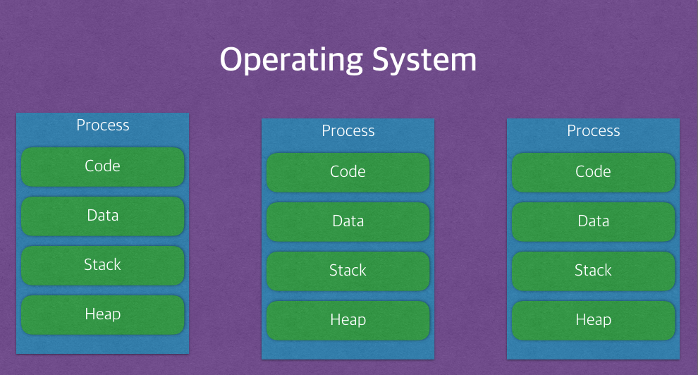

# 3.Operating System
**:radio_button: Contents**
* [프로세스와 스레드](#프로세스와-스레드)    
* [뮤텍스,세마포어,모니터](#뮤텍스,세마포어,모니터)
* [스케줄러](#스케줄러)
* [동기와 비동기](#동기와-비동기)
* [가상 메모리](#가상-메모리)

---

### 프로세스와 스레드
> https://lalwr.blogspot.com/2016/02/process-thread.html

#### 프로세스는 프로그램이 실행되고 있는 상태이며, OS로 부터 자원(메모리)을 할당 받는다.  
#### 스레드는 한개의 프로세스 내에서 동작되는 여러 실행의 흐름

프로세스는 운영체제로 부터 자원을 할당받는 작업의 단위이고, 스레드는 프로세스가 할당받은 자원을 이용하는 실행의 단위이다.

* 프로그램  - 어떤 작업을 위해 실행할 수 있는 파일
* 프로세스
    * 메모리에 올라와 CPU를 할당받고 프로그램이 실행되고 있는 상태
    * 즉, 프로세스는 운영체제로부터 자원을 할당 받는 단위이며, 쉽게 말해 컴퓨터에서 실행중인 컴퓨터 프로그램을 의미한다.
    
    * 프로세스의 특징
        * 프로세스는 프로그램 실행시 Code, Data, Stack, Heap 의 구조로 되어 있는 독립된 메모리 영역을 할당 받는다.
        
        
        
        * 이런 특징은 멀티 프로세싱 방식에서 단점을 가진다. --> 멀티 프로세싱의 방식은 CPU에서 여러 프로세스를 로테이션으로 돌면서 처리하게 된다.( 스케쥴링 알고리즘 ) 
        * 동작중인 프로세스가 대기하며 해당 프로세스의 상태(Context)를 보관하고, 대기하고 있던 다음 순번의 프로세스가 동작하면서 이전에 보관했던 프로세스의 상태(Context) 를 복구하게 된다. 이러한 일련의 과정을 context switching이라 하는데, 프로세스는 각각 독립된 메모리이기 때문에 무거운 작업이 발생하게 되고, 오버헤드가 발생한다.

* 스레드
    * 프로세스가 할당받은 자원을 이용하는 실행의 단위
    * 기본적으로 하나의 프로세스가 생성되면 하나의 스레드가 같이 생성되는데, 이를 메인 스레드라고 부른다. 스레드를 추가로 생성하지 않는 한, 모든 프로그램 코드는 메인 스레드에서 실행된다.
    
    * 스레드의 특징
        * 스레드는 프로세스 내에서 각각 Stack만 따로 할당받고, Code, Data, Heap 영역을 공유한다.
        
        
        
        * 이런 특징은 많은 장점을 가진다  
            * 스레드간 데이터를 주고받는 것이 간단해짐( 메모리를 공유하기 때문에 ) + 응답시간 단축 및 시스템 자원소모가 줄어든다.
            * 멀티 프로세싱의 단점인 ContextSwitching의 오버헤드에 대한 부분을 해결해준다. ( 프로세스와 달리 Code, Data, Heap영역을 공유하므로, stack 영역만 처리하면 되고, 처리비용이 감소한다.)
        * 하지만 디버깅이 어렵고, 충돌이 일어날 가능성이 있다는 단점도 있다.
        
    * 멀티스레드
    1. 자원의 효율성이 증대
        * 멀티 프로세스로 실행되는 작업을 멀티 스레드로 실행할 경우, 프로세스를 생성하여 자원을 할당하는 시스템 콜이 줄어들어 자원을 효율적으로 관리할 수 있다.
            * 프로세스 간의 Context Switching시 단순히 CPU 레지스터 교체 뿐만 아니라 RAM과 CPU 사이의 캐시 메모리에 대한 데이터까지 초기화되므로 오버헤드가 크기 때문이다.
        * 스레드는 프로세스 내의 메모리를 공유하기 때문에 독립적인 프로세스와 달리 스레드 간 데이터를 주고 받는 것이 간단해지고 시스템 자원 소모가 줄어들게 된다.
        
    2. 처리 비용 감소 및 응답 시간 단축
        * 프로세스 간의 통신(IPC)보다 스레드 간의 통신의 비용이 적으므로 작업들 간의 통신의 부담이 줄어든다.
            * 스레드는 Stack 영역을 제외한 모든 메모리를 공유하기 때문이다.
        * 프로세스 간의 전환 속도보다 스레드 간의 전환 속도가 빠르다.
            * Context Switching시 스레드는 Stack 영역만 처리하기 때문

********************

### 뮤텍스,세마포어,모니터
> 동기화 :  시스템의 자원은 한정적인데, 이 한정적인 자원에 여러 스레드가 동시에 점근해서 사용하려면 문제가 발생한다. 이러한 문제를 방지하기 위해 스레드들에게 하나의 자원에 대한 처리 권한을 주거나 순서를 조정해주는 기법이다.

* 상호배제(Mutual Exclusion), 임계영역(Critical Section/Region)이란?
    * Mutual Exclusion
        * Multi Threading/Processing과 같이 concurrent한 환경에서 공유 자원에 동시에 접근할 경우 많은 문제점이 발생할 수 있다. 이러한 상황을 예방하기 위해 "동시에 접근하지 않는 약속"을 하는 것이 Mutual Exclusion(상호배제)이다.
        * 한 프로세스가 공유 자원을 접근하는 임계영역 코드를 수행하고 있으면, 다른 프로세스들은 공유 자원을 접근하는 임계영역 코드를 수행할 수 없다는 조건
    * Critical Section
        * 다중 프로그래밍 운영체제에서 여러 프로세스가 데이터를 공유하면서 수행될 때, 각 프로세스에서 공유 데이터를 액세스하는 프로그램 코드 부분 ( **공유 자원에 접근하는 코드 영역**)
        * 공유데이터를 여러 프로세스가 동시에 액세스하면 시간적인 차이 때문에 잘못된 결과를 만들어 낼 수 있기 때문에, 한 프로세스가 위험 부분을 수행하고 있을 때(공유 데이터를 엑세스하고 있을 때) 다른 프로세스들은 그 데이터에 액세스하지 못하도록 해야한다.
    

* Mutex, Semaphore, Monitor -- Mutual Exclusion을 해결하기 위한 방법들
1) Mutex
    * 일종의 locking 메커니즘. lock을 가지고 있을 경우에만 공유데이터에 접근 가능하다.
    * 공용화장실에 비유 - 화장실은 항상 잠겨있고, 손님들이 화장실에 가려면 주인에게 열쇠를 받은 후 간다. 다음 손님이 화장실에 가려면 앞 손님이 열쇠를 반납해야 갈 수 있다. 열쇠가 있는 경우(lock을 가지고 있는 경우)에만 공유자원(화장실)에 접근할 수 있다.
    * lock에 대한 소유권이 있으며, 뮤텍스 객체를 두개의 쓰레드가 동시에 사용할 수 없다.

2) Semaphore
    * 동시에 리소스에 접근할 수 있는 '허용 가능한 Counter의 갯수'를 가지고 있는 counter이다.
    * 예를 들어 맛집에 테이블이 5개가 있다. 맛집 직원은 손님이 5팀만 들어갈 수 있도록 허용하고, 나머지 손님들은 밖에서 대기하도록 한다. Counter(테이블) 갯수 만큼 공유자원(맛집)에 접근할 수 있다. 이 세마포어 counter의 갯수에 따라 1개의 경우 Binary semaphore, 2개 이상의 경우 counting semaphore라 하며, Binary semaphore의 경우 Mutex와 같다고 볼 수 있다.
    * 세마포어는 운영체제 또는 커널의 한 지정된 저장장치 내 값으로, 각 프로세스는 이를 확인하고 변경할 수 있다. 확인되는 세마포어의 값에 따라, 그 프로세스가 즉시 자원을 사용할 수 있거나, 또는 이미 다른 프로세스에 의해 사용중이라는 사실을 알면 재시도하기 전 일정 시간을 기다려야한다.

3) Monitor
    * 프로세스나 스레드를 동기화하는 방법 중 하나로, 그 방법으로 활용하기 위해 구현된 기능 혹은 모듈 --> 하나의 프로세스만 모니터에서 활동하도록 보장해준다.
    * semaphore이 어셈블리 언어에 적합하다면, 모니터는 고수준의 언어 의 도구이다.
    * 어떤 공유 데이터에 대해 모니터를 지정해 놓으면, 프로세스는 그 데이터를 접근하기 위해 모니터에 들어가야만 한다. 다른 프로세스가 모니터 내부에 있다면, 입장 큐에서 기다려야 한다.
    * Mutex(Lock)와 Condition variables(Queue)을 가지고 있는 Synchronization 메커니즘이다. (Mutex의 상위 호환 )
    * 자바에서 모든 객체는 Object 클래스를 상속받는데, 이 클래스에는 wait(), notifyAll(), notify() 메소드를 가지고 있으며, 이것이 바로 Condition vatiables 역할이다.

* Semaphore와 Mutex의 차이
    * 세마포어는 뮤텍스가 될 수 있지만, 뮤텍스는 세마포어가 될 수 없다.
    * 세마포어는 소유할 수 없으며, 뮤텍스는 소유할 수 있고, 소유주가 그에 대한 책임을 진다.
    * 뮤텍스의 경우, 뮤텍스를 소유하고 있는 스레드가 이 뮤텍스를 해제 할 수 있다. 하지만, 세마포어는 소유하지 않고 있는 스레드가 세마포어를 해제할 수 있다.
    * 세마포어는 시스템 범위에 걸쳐있고, 파일 시스템 상의 파일형태로 존재한다. 하지만 뮤텍스는 프로세스 범위를 가지고, 프로그램이 종료될 때 자동으로 지워진다.
    * 세마포어는 동기화 대상이 여러개일 때, 뮤텍스는 동기화 대상이 오로지 하나일 때 사용된다.
    
