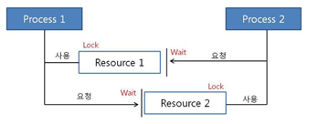

# 3.Operating System
**:radio_button: Contents**
* [프로세스와 스레드](#프로세스와-스레드)    
* [뮤텍스 세마포어 모니터](#뮤텍스-세마포어-모니터)
* [스케줄러](#스케줄러)
* [동기와 비동기](#동기와-비동기)
* [가상 메모리](#가상-메모리)
* [캐시](#캐시)
* [교착상태(Deadlock)](#Deadlock)

* [busyWaiting](#BusyWaiting)
* [kernel과 shell](#kernel과-shell)
* [프로세서의 구조](#프로세서의-구조)

* [CPU 스케쥴링 알고리즘](#CPU-스케쥴링-알고리즘)
-------

# 프로세스와 스레드
> https://lalwr.blogspot.com/2016/02/process-thread.html

#### 프로세스는 프로그램이 실행되고 있는 상태이며, OS로 부터 자원(메모리)을 할당 받는다.  
#### 스레드는 한개의 프로세스 내에서 동작되는 여러 실행의 흐름

프로세스는 운영체제로 부터 자원을 할당받는 작업의 단위이고, 스레드는 프로세스가 할당받은 자원을 이용하는 실행의 단위이다.

* 프로그램  - 어떤 작업을 위해 실행할 수 있는 파일
* 프로세스
    * 메모리에 올라와 CPU를 할당받고 프로그램이 실행되고 있는 상태
    * 즉, 프로세스는 운영체제로부터 자원을 할당 받는 단위이며, 쉽게 말해 컴퓨터에서 실행중인 컴퓨터 프로그램을 의미한다.
    
    * 프로세스의 특징
        * 프로세스는 프로그램 실행시 Code, Data, Stack, Heap 의 구조로 되어 있는 독립된 메모리 영역을 할당 받는다.
        
        
        
        * 이런 특징은 멀티 프로세싱 방식에서 단점을 가진다. --> 멀티 프로세싱의 방식은 CPU에서 여러 프로세스를 로테이션으로 돌면서 처리하게 된다.( 스케쥴링 알고리즘 ) 
        * 동작중인 프로세스가 대기하며 해당 프로세스의 상태(Context)를 보관하고, 대기하고 있던 다음 순번의 프로세스가 동작하면서 이전에 보관했던 프로세스의 상태(Context) 를 복구하게 된다. 이러한 일련의 과정을 context switching이라 하는데, 프로세스는 각각 독립된 메모리이기 때문에 무거운 작업이 발생하게 되고, 오버헤드가 발생한다.

* 스레드
    * 프로세스가 할당받은 자원을 이용하는 실행의 단위
    * 기본적으로 하나의 프로세스가 생성되면 하나의 스레드가 같이 생성되는데, 이를 메인 스레드라고 부른다. 스레드를 추가로 생성하지 않는 한, 모든 프로그램 코드는 메인 스레드에서 실행된다.
    
    * 스레드의 특징
        * 스레드는 프로세스 내에서 각각 Stack만 따로 할당받고, Code, Data, Heap 영역을 공유한다.
        
        
        
        * 이런 특징은 많은 장점을 가진다  
            * 스레드간 데이터를 주고받는 것이 간단해짐( 메모리를 공유하기 때문에 ) + 응답시간 단축 및 시스템 자원소모가 줄어든다.
            * 멀티 프로세싱의 단점인 ContextSwitching의 오버헤드에 대한 부분을 해결해준다. ( 프로세스와 달리 Code, Data, Heap영역을 공유하므로, stack 영역만 처리하면 되고, 처리비용이 감소한다.)
        * 하지만 디버깅이 어렵고, 충돌이 일어날 가능성이 있다는 단점도 있다.
        
    * 멀티스레드
    1. 자원의 효율성이 증대
        * 멀티 프로세스로 실행되는 작업을 멀티 스레드로 실행할 경우, 프로세스를 생성하여 자원을 할당하는 시스템 콜이 줄어들어 자원을 효율적으로 관리할 수 있다.
            * 프로세스 간의 Context Switching시 단순히 CPU 레지스터 교체 뿐만 아니라 RAM과 CPU 사이의 캐시 메모리에 대한 데이터까지 초기화되므로 오버헤드가 크기 때문이다.
        * 스레드는 프로세스 내의 메모리를 공유하기 때문에 독립적인 프로세스와 달리 스레드 간 데이터를 주고 받는 것이 간단해지고 시스템 자원 소모가 줄어들게 된다.
        
    2. 처리 비용 감소 및 응답 시간 단축
        * 프로세스 간의 통신(IPC)보다 스레드 간의 통신의 비용이 적으므로 작업들 간의 통신의 부담이 줄어든다.
            * 스레드는 Stack 영역을 제외한 모든 메모리를 공유하기 때문이다.
        * 프로세스 간의 전환 속도보다 스레드 간의 전환 속도가 빠르다.
            * Context Switching시 스레드는 Stack 영역만 처리하기 때문

********************

# 뮤텍스 세마포어 모니터
> 동기화 :  시스템의 자원은 한정적인데, 이 한정적인 자원에 여러 스레드가 동시에 점근해서 사용하려면 문제가 발생한다. 이러한 문제를 방지하기 위해 스레드들에게 하나의 자원에 대한 처리 권한을 주거나 순서를 조정해주는 기법이다.

* 상호배제(Mutual Exclusion), 임계영역(Critical Section/Region)이란?
    * Mutual Exclusion
        * Multi Threading/Processing과 같이 concurrent한 환경에서 공유 자원에 동시에 접근할 경우 많은 문제점이 발생할 수 있다. 이러한 상황을 예방하기 위해 "동시에 접근하지 않는 약속"을 하는 것이 Mutual Exclusion(상호배제)이다.
        * 한 프로세스가 공유 자원을 접근하는 임계영역 코드를 수행하고 있으면, 다른 프로세스들은 공유 자원을 접근하는 임계영역 코드를 수행할 수 없다는 조건
    * Critical Section
        * 다중 프로그래밍 운영체제에서 여러 프로세스가 데이터를 공유하면서 수행될 때, 각 프로세스에서 공유 데이터를 액세스하는 프로그램 코드 부분 ( **공유 자원에 접근하는 코드 영역**)
        * 공유데이터를 여러 프로세스가 동시에 액세스하면 시간적인 차이 때문에 잘못된 결과를 만들어 낼 수 있기 때문에, 한 프로세스가 위험 부분을 수행하고 있을 때(공유 데이터를 엑세스하고 있을 때) 다른 프로세스들은 그 데이터에 액세스하지 못하도록 해야한다.
    

* Mutex, Semaphore, Monitor -- Mutual Exclusion을 해결하기 위한 방법들
1) Mutex
    * 일종의 locking 메커니즘. lock을 가지고 있을 경우에만 공유데이터에 접근 가능하다.
    * 공용화장실에 비유 - 화장실은 항상 잠겨있고, 손님들이 화장실에 가려면 주인에게 열쇠를 받은 후 간다. 다음 손님이 화장실에 가려면 앞 손님이 열쇠를 반납해야 갈 수 있다. 열쇠가 있는 경우(lock을 가지고 있는 경우)에만 공유자원(화장실)에 접근할 수 있다.
    * lock에 대한 소유권이 있으며, 뮤텍스 객체를 두개의 쓰레드가 동시에 사용할 수 없다.

2) Semaphore
    * 동시에 리소스에 접근할 수 있는 '허용 가능한 Counter의 갯수'를 가지고 있는 counter이다.
    * 예를 들어 맛집에 테이블이 5개가 있다. 맛집 직원은 손님이 5팀만 들어갈 수 있도록 허용하고, 나머지 손님들은 밖에서 대기하도록 한다. Counter(테이블) 갯수 만큼 공유자원(맛집)에 접근할 수 있다. 이 세마포어 counter의 갯수에 따라 1개의 경우 Binary semaphore, 2개 이상의 경우 counting semaphore라 하며, Binary semaphore의 경우 Mutex와 같다고 볼 수 있다.
    * 세마포어는 운영체제 또는 커널의 한 지정된 저장장치 내 값으로, 각 프로세스는 이를 확인하고 변경할 수 있다. 확인되는 세마포어의 값에 따라, 그 프로세스가 즉시 자원을 사용할 수 있거나, 또는 이미 다른 프로세스에 의해 사용중이라는 사실을 알면 재시도하기 전 일정 시간을 기다려야한다.

3) Monitor
    * 프로세스나 스레드를 동기화하는 방법 중 하나로, 그 방법으로 활용하기 위해 구현된 기능 혹은 모듈 --> 하나의 프로세스만 모니터에서 활동하도록 보장해준다.
    * semaphore이 어셈블리 언어에 적합하다면, 모니터는 고수준의 언어 의 도구이다.
    * 어떤 공유 데이터에 대해 모니터를 지정해 놓으면, 프로세스는 그 데이터를 접근하기 위해 모니터에 들어가야만 한다. 다른 프로세스가 모니터 내부에 있다면, 입장 큐에서 기다려야 한다.
    * Mutex(Lock)와 Condition variables(Queue)을 가지고 있는 Synchronization 메커니즘이다. (Mutex의 상위 호환 )
    * 자바에서 모든 객체는 Object 클래스를 상속받는데, 이 클래스에는 wait(), notifyAll(), notify() 메소드를 가지고 있으며, 이것이 바로 Condition vatiables 역할이다.

* Semaphore와 Mutex의 차이
    * 세마포어는 뮤텍스가 될 수 있지만, 뮤텍스는 세마포어가 될 수 없다.
    * 세마포어는 소유할 수 없으며, 뮤텍스는 소유할 수 있고, 소유주가 그에 대한 책임을 진다.
    * 뮤텍스의 경우, 뮤텍스를 소유하고 있는 스레드가 이 뮤텍스를 해제 할 수 있다. 하지만, 세마포어는 소유하지 않고 있는 스레드가 세마포어를 해제할 수 있다.
    * 세마포어는 시스템 범위에 걸쳐있고, 파일 시스템 상의 파일형태로 존재한다. 하지만 뮤텍스는 프로세스 범위를 가지고, 프로그램이 종료될 때 자동으로 지워진다.
    * 세마포어는 동기화 대상이 여러개일 때, 뮤텍스는 동기화 대상이 오로지 하나일 때 사용된다.
    
* Semaphore 와 Monitor의 차이
    * 세마포어에 비해 모니터가 공유자원에 점근할 수 있는 키의 획득과 해제를 모두 처리해 주어서 간단하다. 세마포어는 직접 키 해제와 공유자원 접근 처리를 해주어야 한다.
    * 세마포어는 어셈블리 언어에서 적합하지만, 모니터는 그보다 고급 언어 (Java 등)에서 많이 사용된다.
    
    
********************
    
# 스케줄러
* Scheduler의 개념
* Scheduler는 메모리에 있는 여러 프로세스 중에서 어떤 하나의 프로세스가 CPU 점유권을 가질지를 정해주는 것으로, 세가지 종류가 있다 : Long-term, short-term, medium-term Scheduler

* #### 장기스케줄러(Long-term scheduler / job Scheduler)
    * **하드디스크에서 메모리를 프로세스를 load하는 역할을 한다.**
    * 메모리는 한정되어 있는데 많은 프로세스들이 한꺼번에 메모리에 올라올 경우, 대용량 메모리(일반적으로 디스크)에 임시로 저장된다. 이 pool에 저장되어 있는 프로세스 중 어떤 프로세스에 메모리를 할당하여 ready queue로 보낼지 결정하는 역할을 한다.
    * Secondary storage(하드디스크)에 저장되어 있는 프로세스가 사용자의 실행에 의해 Ready 상태, 즉 메모리에 load되는 과정
    
    * more about 장기 스케쥴러
        * 메모리와 디스크 사이의 스케쥴링을 담당
        * 프로세스에 memory(및 각종 리소스)를 할당(admit)
        * degree of multiprogramming 제어 -> 메모리에 여러 프로그래밍이 올라가는 것. 몇개의 프로그램이 올라갈 것인지를 제어
        * 프로세스의 상태 : new -> ready(in memory)  
    
* #### 단기스케줄러 (Short-term Scheduler / CPU Scheduler)
    * **메모리에 있는 프로세스 중 프로세스가 CPU 점유권을 가질 때 어떤 프로세스가 선택되는지를 결정하는 스케줄러이다.**
    * CPU의 Scheduling에 의해 CPU 점유권을 받아 프로세스가 실제로 실행된다.
    
     * more about 단기 스케쥴러
        * CPU와 메모리 사이의 스케쥴링을 담당
        * Ready Queue에 존재하는 프로세스 중 어떤 프로세스를 running 시킬지 결정
        * 프로세스에 CPU를 할당 (Scheduler dispatch)
        * 프로세스의 상태 : ready -> running -> waiting -> ready

* #### 중기스케줄러(Medium-term scheduler or swapper)
    * Unix나 window에서는 장기스케줄러가 거의 사용되지 않고, 중기 스케쥴러를 주로 사용한다.
    * 메모리에서 CPU를 쓰기위해 경쟁하고 있는 프로세스를 제거 후 추후에 다시 메모리로 불러와서 중단되었던 지점부터 다시 실행을 재개한다. (Swapping 기법)
    
    * more about 중기 스케쥴러
        * 여유 공간 마련을 위해 프로세스를 통째로 메모리에서 디스크로 쫓아냄(Swapping)
        * 프로세스에게서 memory 를 deallocate
        * degree of multiprogramming 제어
        * 현 시스템에서 메모리에 너무 많은 프로그램이 동시에 올라가는 것을 조절하는 스케줄러
        * 프로세스의 상태 : ready -> suspended
    

* 장기 스케줄러와 단기 스케줄러의 차이
    * 장기 스케줄러와 단기 스케줄러의 가장 큰 차이점은 실행 빈도이다.
        * 프로세스의 경우 밀리초 단위로 실행되고, 다시 단기 스케줄러를 실행한다. --> 단기 스케줄러는 상당히 빠르다.
    * 시스템에 새로운 작업이 들어오는 것은 분단위이다. --> 장기스케줄러는 단기스케줄러 보다 적게 실행된다.

********************

# 동기와 비동기
* 동기 (Synchronous : 동시에 일어나는)
    * 요청과 그 결과가 동시에 일어남. 요청을 하면 요청한 자리에서 결과가 주어져야한다.
    * A 노드와 B 노드 사이의 작업 처리 단위(transaction)를 동시에 맞춘다.
    * 동기식 전송은 한 문자 단위가 아니라, 미리 정해진 수 만큼의 문자열을 한묶음으로 만들어 일시에 전송하는 방법이다. 이 방법에서는 데이터와는 별도로 송신측과 수신측이 하나의 기준 클록으로 동기 신호를 맞추어 동작한다. 수신 측에서는 클록에 의해 비트를 구별하게 되므로, 동기식 전송을 위해서는 데이터와 클록을 위한 2회선이 필요하다. 송신 측에서 2진 데이터들을 정상적인 속도로 내보내면, 수신측에서는 클록의 한 사이클 간격으로 데이터를 인식한다.
    * 전송 효율이 높다는 것이 장점이지만, 수신측에서 비트 계산을 해야하며, 문자를 조립하는 별도의 기억장치가 필요하다.

* 비동기(Asynchronous : 동시에 일어나지 않는)
    * 비동기는 동시에 일어나지 않는다는 것을 의미한다. 요청과 결과가 동시에 일어나지 않는다.
    * 노드 사이의 작업 처리 단위를 동시에 맞추지 않아도 된다.
    * 에디터 내에 동기신호를 포함시켜 데이터를 전송한다. 송신 측의 송신 클록에 관계없이 수신신호 클록으로 타임 슬롯의 간격을 식별하여 한번에 한 문자씩 송수신한다. ( 문자는 7~8 비트로 구성되며, 문자의 앞에 시작비트(start bit)를, 끝에는 정지비트(stop bit)를 첨가해서 보낸다.
    * 비동기식 전송은 시작비트와 정지비트 사이의 간격이 가변적이므로 불규칙적인 전송에 적합하다. 

* 동기방식은 설계가 매우 간단하고 직관적이지만, 결과가 주어질 때까지 아무것도 못하고 대기해야하는 단점이 잇다.
* 비동기 방식은 동기보다 복잡하지만, 결과가 주어지는데 시간이 걸리더라도, 그 시간 동안 다른 작업을 할 수 있어 자원을 효율적으로 사용할 수 있는 장점이 있다.

********************

# 가상 메모리
> http://egloos.zum.com/sweeper/v/2988689
> https://frontalnh.github.io/2018/04/04/운영체제-가상-메모리란-무엇인가/
> http://truemind5.blogspot.com/search/label/15.%20가상%20메모리

#### 가상메모리
* 가상 메모리의 개념
    * **가상메모리는 프로세스 전체가 메모리에 적재되지 않고도 실행이 가능하도록 하는 기법이다.** 
    * 현재 필요한 부분만 메모리에 적재하여, 물리 메모리 용량을 초과하는 프로그램도 동작시킬수 있게한다.
    * 실제 물리 메모리의 개념과 **사용자의 논리 메모리의 개념을 분리**한다.
    * 가상메모리를 프로세스가 차지하는 공간의 측면에서 **가상 주소 공간**이라 부르고, 이는 프로세스가 메모리에 저장되는 논리적인 모습을 말한다. 
    * 가상메모리를 사용하면 메모리가 둘 또는 그 이상의 프로세스들에 의해 공유되는 것을 가능하게 한다 

#### 요구페이징
* 요구페이징이란?
    * 프로그램을 실행할 때 가상메모리에서는 초기에 필요한 것만 적재하는 전략을 사용할 수 있는데, 이를 요구 페이징이라 한다.
    * 프로세스를 페이지 단위로 나누고, CPU가 처리하는데 필요한 페이지만(요구되는 페이지만) 메모리에 적재한다.
    * 메모리에 적재되지 못한 프로세스의 나머지 페이지들은 backing store에 저장되어져 있다.
    * 요구 페이징을 사용하게 되면, 한번도 접근되지 않는 페이지는 물리 메모리에 전혀 적재되지 않게된다.
    
    
    
    * 페이지 테이블
        * 특정 프로세스 내에서 어떤 페이지가 실제메모리에 적재되었는지, 또 적재되지 않았는지를 구별할 수 없게 되어 이러한 문제를 해결하기 위해 존재.
        * 유효-무효 비트가 존재하여 어떤 페이지가 실제 물리 메모리에 적재되어있는지를 표시해주고, 실제 물리 메모리에 적재되지 않은 페이지는 그 페이지가 저장되어있는 디스크 주소를 기록해 둔다.
    
    * 페이지 부재(Page Fault)
        * CPU가 필요로 하는 Page가 메인 메모리에 적재되어져 잇지 않은 경우를 의미한다.
        * 페이지 부재(Page fault)가 발생하면 해당 페이지를 메모리에 적재해 줘야한다.
    
    * 순수요구 페이징 (Pure demand Paging) <-> prepaging
        * 순수하게 현재 시점에 필요한 페이지만 적재한다.(어떤 페이지가 필요하기 전까지는 적재하지 않는다.)
        * 메모리 절약을 최대화할 수 있지만, 시작하자마자 페이지 부재가 일어나고, 속도가 느려진다.
        

#### 페이지 교체
* 페이지 부재의 발생 : 요구되는 페이지를 backing store에서 가져다가 메모리의 빈프레임에 적재한다.  -> 이것이 반복되면 메인 메모리가 가득차게 된다. (memory full) : Over-allocationg( 과할당 - 프로세스가 메모리 보다 더 큰 용량의 페이지를 적재하려고 할 때 발생)

* 메모리가 full이면 페이지 교체가 발생한다. : 요구되는 페이지를 메모리에 적재하기 위해서
    * (1) 현재 메모리에 적재되어 있는 특정 페이지를 backing store로 몰아낸다. (page-out)
    * (2) 그 빈공간에 요구되는 페이지를 적재한다. (page-in)
    
* victim page (희생 페이지)
    * 요구 페이지를 가져오기 위해 현재 메모리에 적재되어 있지만 몰아내야 하는 페이지
    * 수정되지 않은 페이지를 희생페이지로 삼으면 I/O 시간을 절약할 수 있기 때문에 처리속도가 상대적으로 빨라진다.

* 페이지 교체의 동작 원리
    1) 디스크에서 적재가 필요한 페이지의 위치를 알아낸다
    2) 메모리 공간에서 빈 페이지 프레임을 찾는다. 이때 빈 프레임이 있다면 그것을 사용하고 없다면 페이지 교체 알고리즘을 통해 victim 프레임을 선정하고, 희생될 페이지를 디스크에 기록한 뒤 테이블을 수정한다.
    3) 새롭게 비워진 프레임에 새 페이지를 읽어오고 프레임 테이블을 수정한다.
    4) 사용자 프로세스를 재시작한다.

    * 메모리 공간에 빈 페이지 프레임이 있는 경우에는 프레임을 비울 때 한번, 프레임을 읽어들일 때 한번 총 2번에 걸쳐 디스크에 접근한다. --> 이 때문에 페이지 부재 처리시간은 총 2배가 소요되게 되는데, 이러한 오버헤드는 **변경비트**를 활용해서 해결할 수 있다.
    * 변경비트란 CPU가 페이지 내 어떤 워드나 바이트라도 쓰게 되면 페이지가 변경되었음을 나타내기 위해 설정된다.  만약 변경 비트가 설정되어 있지 않다면, 페이지가 메모리로 읽혀들어온 후 바뀌지 않았으므로 메모리에서 그냥 삭제해도 디스크에는 원본이 잘 보존되어 있어 별도로 저장하지 않아도 된다. 

* 페이지 교체 알고리즘 --> 페이지 부재율이 가장 낮은 것을 선정하는 알고리즘을 주로 사용한다.
    * 선입선출 페이지 교체 ( FIFO Page Replacement)
        * 각 페이지에 메모리 적재시간을 연관시켜 가장 오래된 페이지를 교체하는 알고리즘이다. 하지만, 치명적인 문제는 일어나지 않는다. 페이지가 교체되어도 필요한 시점에서 바로 부재처리가 되어 다시 메모리에 적재시키며 프로세스가 동작하기 때문이다.
        * 페이지 부재율이 많이 높아지게 되고, 효율적이지 못한 동작이 일어난다.

* 최적 페이지 교체(Optimal page replacement)
    * Belady의 모순 - 많은 프레임을 할당해 주었는데도 반대로 페이지 부재율이 더 증가하는 현상.
    * 최적 교체 알고리즘은 앞으로 가장 오랫동안 사용되지 않을 페이지를 찾아 교체하는 알고리즘이며, 프레임 수가 고정된 경우 가장 낮은 페이지 부재율을 보장한다. 하지만 구현이 어렵고, 주로 비교 연구 목저을 위해 가장 최선의 경우를 계산할 목적으로 사용된다. ( 레퍼런스로 사용 )

* LRU 페이지 교체(LRU Page Replacement)
    * 최적 페이지 교체 알고리즘이 미래에 사용되지 않을 페이지를 찾아 교체하는 것이라 할때, 최근의 과거를 미래의 근사치로 본다면 가장 오랜시간 사용되지 않은 페이지를 교체할 수 있고, 이것이 LRU 알고리즘이다.
    

********************

# 캐시
캐시는 데이터나 값을 미리 복사해 놓는 임시 장소를 가리킨다. 캐시는 캐시의 접근 시간에 비해 원래 데이터를 접근하는 시간이 오래 걸리는 경우나 값을 다시 계산하는 시간을 절약하고 싶은 경우데 사용한다. 캐시에 데이터를 미리 복사해 놓으면 계산이나 접근 시간 없이 더 빠른 속도로 데이터에 접근할 수 있다.

* 캐시의 종류
    * 디스크 캐시 - 하드디스크는 디스크 제어와 외부와의 인터페이스를 위해 작은 컴퓨터를 내장하고 있다. 이 작은 컴퓨터에 디스크에 입출력되는 데이터를 저장하는 작은 메모리를 갖고 있는데, 이를 디스크 캐시라고 한다. 
        * 역할 1 - 미리읽기 : 운영 체제에서 디스크에 읽기/쓰기를 요청할 때, 연속된 위치에 대한 반복적 접근 시간을 아끼기 위해 디스크는 뒷부분의 데이터를 미리 읽어 캐시에 저장해 놓는다.
        * 역할 2 - 속도 조절 : 디스크 입출력 인터페이스는 디스크 플래터가 데이터를 읽어들이는 속도에 비해 훨씬 느리다. 디스크 암이 빠르게 읽고 쓰기를 수행하기 위해 데이터를 인터페이스에 넘기기 전 캐시에 잠시 저장한다.
        * 역할 3 - 쓰기 가속 : 운영체제가 디스크에 쓰기를 요청했을 때, 캐시에 데이터를 저장해 놓고, 디스크 암이 쓰기를 끝내기 전 운영체제에 쓰기가 끝났음을 보고한다. --> 운영체제가 디스크 쓰기가 끝나는 것을 기다릴 필요 없이 다음 작업을 신속하게 수행한다. / 하지만 데이터 안정성에 문제가 있어, 사용하지 않는 경우도 있다.
        * 명령 큐 : 다른 명령을 수행하고 있는 중에도 여러 개의 명령을 추가로 받을 수 있다. 이 명령 큐는 나중에 처리하기 위해 디스크 캐시에 저장된다. 명령큐는 쓰기가 완전히 끝났을 때 운영체제에 그 사실을 알림으로 써, 파일시스템의 정확성을 유지한다.
    
    * 기타 캐시 - CPU 캐시는 하드웨어를 통해 관리되고, 그 밖의 캐시는 소프트웨어적으로 관리된다. 운영 체제의 메인 메모리를 하드 디스크에 복사해 놓는 페이지 캐시는 운영체제 커널과 파일 시스템에 의해 관리된다. 많은 인터넷 제공업체들은 웹페이지의 캐시를 프록시 서버에 저장하여 웹페이지 요청에 응답하게 함으로써 네트워크 대역폭을 아낀다.  

* 캐시의 지역성 - 캐시가 효율적으로 동작하려면, 캐시에 저장할 데이터가 지역성을 가져야한다. 지역성이란, 데이터 접근이 시간적, 혹은 공간적으로 가깝게 일어나는 것을 의미한다.

    * 시간적 지역성  
     특정 데이터가 한번 접근되었을 경우, 가까운 미래에 또 한번 데이터에 접근할 가능성이 높은 것을 시간적 지역성이라 한다.  
     메모리 상의 같은 주소에 여러 차례 읽기 쓰기를 수행할 경우, 상대적으로 작은 크기의 캐시를 사용해도 효율성을 꾀할 수 있다.
     
     * 공간적 지역성 
       특정 데이터와 가까운 주소가 순서대로 접근되었을 경우 공간적 지역성이라 한다. CPU 캐시나 디스크 캐시의 경우 한 메모리 주소에 접근할 때 그 주소뿐 아니라 해당 블록을 전부 캐시에 가져오게 된다. 이때 메모리 주소를 오름차순이나 내림차순으로 접근한다면, 캐시에 이미 저장된 같은 블록의 데이터를 접근하게 되므로, 캐시의 효율성이 향상된다.

* **L1 Cache and L2 Cache**  
L은 level을 가리키며, 코어와 가까울 수록, level이 낮다. ( 코어에 가장 가까운 것이 L1)  
   * **L1 cache**  
   메모리의 속도가 빨라도, CPU의 클럭속도를 따라가지 못한다. 따라서 CPU는 명령을 처리한 후에 메모리로 그 결과를 전송하고, 다시 새로운 데이터가 돌아오기 전까지는 쉬고있게 된다.  
   메모리는 CPU가 필요로 하는 정도의 데이터를 공급해 줄 수 없으므로, 이 문제를 해결하기 위해 CPU에 캐시라는 빠른 속도의 메모리를 만들어 놓고, 자주 사용하는 데이터나 명령어를 저장하여 빠른 속도로 처리할 수 있도록 한다. L1 캐시는 일반적으로 CPU 칩 안에 내장되어 데이터 사용/참조에 가장 먼저 사용된다.  
   L1 캐시와 L2 캐시 모두 SRAM을 사용하며, L1 캐시의 처리속도는 CPU의 클럭속도와 비슷하기 때문에 속도 차이에 의한 병목형상을 극복할 수 있다.
   
   * **L2 cache**  
   CPU가 L1 캐시 메모리에서 데이터를 찾지 못하면, L2 캐시 메모리로 넘어가게 된다. 용도와 역할은 L1 캐시 메모리와 비슷하지만 속도는 그보다 느리다. L2 캐시는 CPU 회로판에 별도의 칩으로 내장된다.
   
> https://12bme.tistory.com/402
   
* **레지스터와 캐시의 차이**  
> http://hellogohn.com/post_one371
********************

# Deadlock
 * 프로세스가 자원을 얻지 못해 다음 처리를 하지 못하는 상태로, 시스템적으로 한정된 자원을 여러곳에서 사용하려고 할 때 발생한다.  
 
 * 데드락의 발생
 
    
    
    * Process1과 Process2가 Resource1과 Resource2 모두 얻어야하는 상황에서, t1 때 Process1이 Resource 1을 얻고, Process2가 Resource 2를 얻었다면,  t2 때 Process1은 Resource2를, Process2는 Resource1을 기다리게 된다.  

    * 하지만 서로 원하는 리소스가 상대방에 할당되어 있어, 이 두 프로세스는 무한정 기다리는데, 이를 Deadlock 상태라고 한다.
    
* 데드락의 발생 조건 -> 4가지 조건이 동시에 성립할때 발생하며, 네가지 조건중 하나라도 성립하지 않으면 교착상태를 해결할 수 있다.  

    1) 상호배제(Mutual exclusion) -> 자원은 한번에 한 프로세스만이 사용할 수 있어야 한다.
    2) 점유대기(Hold and wait) -> 최소한 하나의 자원을 점유하고 있으면서 다른 프로세스에 할당되어 사용하고 있는 자원을 추가로 점유하기 위해 대기하는 프로세스가 있어야 한다.
    3) 비선점(No preemption) -> 다른 프로세스에 할당된 자원은 사용이 끝날 때까지 강제로 빼앗을 수 없어야 한다.
    4) 순환대기(circular wait) -> 두 개 이상의 프로세스가 자원 접근을 기다리는데, 그 관계에 사이클이 존재한다.

* 대부분의 교착상태 방지 알고리즘은 4번 조건, 즉 대기 상태의 사이클이 발생하는 일을 막는 데 초점이 맞춰져 있다.  

****************************

# busyWaiting
   * Busy Waiting란 용어를 설명해보고 어떻게 하면 바쁜 대기를 피할 수 있는가?
      * 바쁜 대기란, A와 B라는 두개의 쓰레드가 공유 자원을 사용하려고 할때 a쓰레드가 공유 자원을 먼저 사용하게 되면 b쓰레드는 a쓰레드가 사용을 마칠때 까지 기다려야 한다. 이때 b쓰레드는 a쓰레드가 공유 자원 사용을 끝냈는지 계속 무한 루프를 돌면서 확인하게 되는데 이것이 바쁜 대기이다.
      
      * 이를 해결하기 위해서는 세마포어, 모니터 두가지 방식이 있다. 세마포어의 경우 공유 자원을 사용하기 전에 뮤텍스 락을 얻고, 다 사용하고 나서는 뮤텍스 락을 해제한다. 뮤텍스 락을 갖고 있는 동안 다른 쓰레드는 공유자원에 접근하지 못한다. 그리고 락을 해제하는 순간 다른 쓰레드가 깨어나기 때문에, 바쁜대기를 할때 처럼 cpu자원을 낭비할 필요도 없다. 모니터는 세마포어에서 뮤텍스 락을 얻고 해제하는 부분이 자동으로 된다는 점만 빼고는 거의 세마포어와 비슷하다.

> 출처 : https://simsimjae.tistory.com/289 [SSJ]
 
 
 ****************************

# kernel과 shell

* **kernel**
   * 커널은 운영체제의 핵심으로, 소프트웨어와 하드웨어 간의 커뮤니케이션을 관리하는 프로그램이다.(운영체제에서 가장 중요한 구성요소)  
   * 입출력을 관리하고, 소프트웨어로부터의 요청을 하드웨어(CPU, 메모리, 저장장치 등)가 처리할 수 있도록 요청을 변환하는 역할을 함.
   * 시스템 자원을 제어하고, 컴퓨터 부팅 시 부트로더에 의해 로드되어 항상 메모리에 상주하게 됨.
   
* **shell**
   * 사용자와 커널 사이의 communication을 할 수 있도록 함.
   * 사용자(명령) -> shell(해석) -> kernel(명령 수행 후 결과 전송) -> shell(해석) -> 사용자(결과 확인)  

사용자가 명령어를 입력하게 되면, 컴퓨터 내부에 shell이 이를 받아들이고, 명령어를 해석하여 커널을 통해 하드웨어를 조작한다. 

> https://jinshine.github.io/2018/05/10/컴퓨터%20기초/커널(Kernel)과%20쉘(Shell)/

 ****************************
 
# 프로세서의 구조

* 프로세서
   * CPU(central processing unit / 중앙처리 장치)
   * Microprocessor(마이크로프로세서)

  
* ALU(Arithmetic and Logic Unit / 연산장치)
   * 더하기, 빼기, 곱하기, 나누기 등의 산술연산과 Not, and, or, xor등의 논리 연산을 수행

* Register
   * 메인메모리(주기억장치)에서 읽어온 명령어와 자료 등을 저장하는 임시 저장장치
   * 연산장치에서 처리된 결과를 임시로 저장하는 저장장치
   * 다음 실행할 명령어의 주소 값을 저장하는 저장장치
   
* Control unit(제어장치)
   * 산술 및 논리연산에 필요한 작업 신호를 연속적으로 보냄으로써, 연산장치와 레지스터가 명령을 수행하게 하는 장치
   * 명령어의 실행에 필요한 연산 순서와 연산 종류 등을 종합적으로 제어

* Internal Bus(내부 버스)
   * 프로세서 내부에서 레지스터와 연산장치(ALU)를 연결, 외부버스(External bus) 연결

  
* cf) 외부버스 
   * 프로세서와 메모리, 프로세서와 입출력장치, 입출력장치와 입출력장치를 연결.
   
   
*************************
# CPU 스케쥴링 알고리즘
