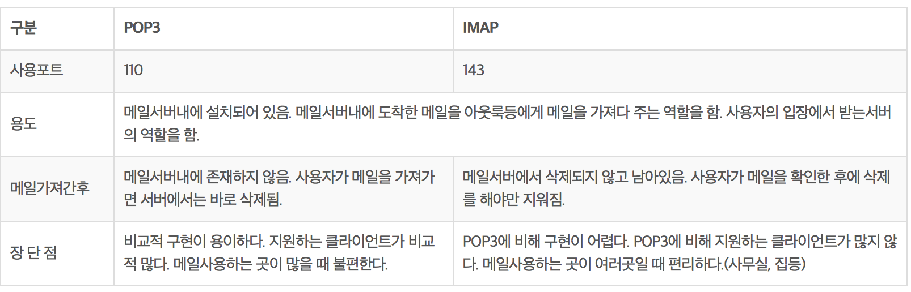
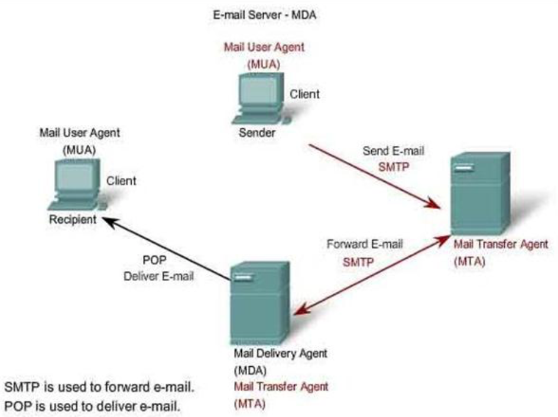
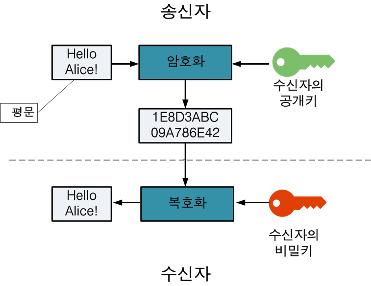

# Private Tech Interview Study

### **:radio_button: Questions** 
a) 지금 사용하는 스마트폰의 해상도는 얼마인가? 화면 캡쳐를 하여 bmp로 저장하면 용량이 어떻게 되는가?
그것을 png와 jpg로 저장하면 각각의 용량이 어떻게 되는가? 동영상의 압축원리는 무엇인가?  
[a에 대한 Answer](#a에-대한-Answer)  

b) 한국의 gmail 사용자가 미국의 gmail 사용자에게 메일을 보냈다. 얼마만에 도착할까? 어떤 과정을 거칠까?  
[b에 대한 Answer](#b에-대한-Answer)  

c) 가상메모리는 무엇인가? 페이지와 스왑은 무엇인가? 디스크와 메모리의 속도차이는 어느정도이고, 그 원인은 무엇인가? SSD의 장점은 무엇인가?  
[c에 대한 Answer](#c에-대한-Answer)  

d) 데이터베이스에 인덱스를 달면 좋은 점은 무엇인가? 그럼 왜 모든 컬럼에 인덱스를 달지 않는가? 멀티 컬럼 인덱스는 무엇인가?   
[d에 대한 Answer](#d에-대한-Answer)  

e) 10GB 짜리 파일을 C드라이브에서 D드라이브로 복사한다. 얼마나 걸릴까? A폰에서 C드라이브로 옮겨온다면? 만약 1MB 짜리 1만개라면 얼마나 걸릴까? 카피를 동시에 여러개 돌리면 더 빨라질까?  
[e에 대한 Answer](#e에-대한-Answer)  

f) C또는 C++ 에서 메모리 관련 버그는 어떤것이 있는가? 각각 디버깅을 어떻게 할 수 있는가? 자바 또는 다른 언어에서 가비지 컬렉터의 역할은 무엇이고 그 원리는 무엇인가?  
[f에 대한 Answer](#f에-대한-Answer)  

g) 암호에서 이야기하는 플레인 텍스트라는 것이 무엇인가? 비대칭 암호화, 그리고 인증서에 대해 설명하라. 사용자의 비밀번호를 안전하게 보관하는 방법은 무엇인가?   
[g에 대한 Answer](#g에-대한-Answer)  

h) Dynamic programming, A* 알고리즘, B+ 트리에 대하여 설명하라   
[j에 대한 Answer](#j에-대한-Answer)  

i) 소스 관리 및 배포에 대해 아는대로 상세히 이야기 하라.  
[k에 대한 Answer](#k에-대한-Answer)  

j) virtual machine에 대해 아는대로 상세히 이야기하라.  
[l에 대한 Answer](#l에-대한-Answer)  

k) AWS 또는 GCP에 대해 아는대로 상세히 이야기하라   
[m에 대한 Answer](#m에-대한-Answer)  

l) NOSQL의 장단점에 대해 이야기하라  
[n에 대한 Answer](#n에-대한-Answer)  

m) ASCII, Unicode, UTF-8에 대해 아는대로 상세히 이야기 하라.  
[o에 대한 Answer](#o에-대한-Answer)  


*********
## a에 대한 Answer
* a) 지금 사용하는 스마트폰의 해상도는 얼마인가? 화면 캡쳐를 하여 bmp로 저장하면 용량이 어떻게 되는가? 
그것을 png와 jpg로 저장하면 각각의 용량이 어떻게 되는가? 동영상의 압축원리는 무엇인가?  

#
아이폰 X의 해상도는 1125x2436 pixel(458ppi)이고 화면비율은 9:19.5이다.  
우선 해상도란, 하나의 이미지를 표현하는데에 몇개의 pixel또는 dot로 나타내는지의 정도를 알려주는 말이다.  
  
PPI는 1인치당 몇개의 픽셀로 이루어져 있는지를 나타내고, 총 픽셀수를 화면 면적으로 나눈 값에 루트를 취해주면 구할 수 있다.  
DPI는 1인치당 몇개의 dot으로 구성되어있는지를 나타낸다. 스마트폰 해상도에서 dpi는 물리적 스크린 영역 내의 화소의 밀도(density)를 표현한다.   같은 크기의 스마트폰에서도 dpi의 차이에 따라 pixel로 크기를 지정하면 낮은 dpi에서는 더 크게 보이고, 높은 dpi에서는 더 작게 보이는 현상이 발생한다. 이러한 문제점 해결을 위해 DIP(Device independent pixel) 단위를 제공한다.  

1dp는 160dpi 스마트폰 스크린에서 1px에 해당한다. 320dpi 스마트폰에서의 1dp는 2px이다.  
즉, 1dp = (디바이스 dpi/160) pixel이다.  

본론으로 돌아가서 이 스마트폰으로 화면 캡쳐를 해서 bmp로 저장했을 때의 용량은 png나 jpg 보다는 클것이다. 기본적으로 iphone으로 화면 캡쳐를 했을때는 기본적으로 png로 저장된다.  
아이폰 X의 해상도인 1125x2436의 각점에 대해 24비트(r,g,b 각각 8비트씩 3개)로 저장하려면 1125x2436x24bit의 저장공간이 필요하다. 이는 약 7.84MB이다. 즉, 아이폰 X로 화면 캡쳐를 해서 bmp로 저장했을때의 이미지 크기가 7.84MB라는 것을 의미한다.  
BMP는 어떠한 압축도 하지 않은 원본 그대로의 화질을 유지한다. 하지만 용량이 커서 잘 사용되진 않는다. PNG는 무손실 압축방식을 사용한다. 압축을 하기 때문에 용량은 줄어들지만, 화질은 그대로이다. 단 무조건 압축되는 것이 아니라, 연속된 색이 많으면 많을수록 압축률이 좋다. jpg는 압축률이 높아 화질열화가 생긴다. 하지만 용량은 가장 낮다.  

같은 사진에 대해서 확장자에 따른 용량은 bmp > png > jpg 이며 png와 jpg는 이미지에 따라 압축률이 달라지기 때문에 구체적인 용량크기는 일반적인 값으로 구할 수 없다.  

#
압축 방식에는 비손실 압축과 손실압축이 잇다. 비손실 압축은 zip, rar와 같은 압축 방식으로 원본 그대로를 압축하는 형식이고, 손실 압축은 원본의 일부분을 변병하는 식으로 압축이 이루어지는 것이기 때문에 원본과 똑같이 되돌릴 수 없다. 사진이나 동영상은 손실압축을 이용한다. 

동영상의 압축은 공간적 압축과 시간적 압축으로 나눌수 있다.  
공간적 압축은 유사한 색깔을 띠는 점을 묶어 평균적인 색깔을 띠는 블럭으로 바꾸는 형태의 압축이다.  
시간적 압축은 키 프레임(key frame)과 델타 프레임(delta frame)을 사용한다. ( keyframe : 완전한 그림 / delta frame : 완전하지 않은 그림)  
델타 프레임은 키프레임에서 변경된 부분의 정보만을 담고 있으며, 동작 변화가 심한 부분은 키프레임을 보다 자주 넣고, 동작변화가 적은 부분에서 키프레임을 가끔씩 넣는 식으로 키프레임 간격을 가변적으로 하며 용량을 줄일 수 있는 효율적인 방식이다. 이러한 방식을 VKI라고 한다.  

> https://m.blog.naver.com/PostView.nhn?blogId=e839638&logNo=140065871619&proxyReferer=https%3A%2F%2Fwww.google.co.kr%2F
  

  
*********
## b에 대한 Answer
* b) 한국의 gmail 사용자가 미국의 gmail 사용자에게 메일을 보냈다. 얼마만에 도착할까? 어떤 과정을 거칠까?   
#

메일을 보내고 받는 과정에 대해 간단하게 보자면 , 사용자가 메일을 보낼 때는 SMTP 프로토콜을 이용하여 전송하며, 메일서버를 거치면서 상대방에 가기까지도 SMTP 프로토콜을 사용한다.  
하지만 받는 사람은 메일서버에 도착되어 있는 메일을 클라이언트로 가져올 때 적용되는 프로토콜인 POP3 / IMAP 을 이용하여 확인하게 된다.  
  
  SMTP ( Simple Mail Transfer Protocol ) : 클라이언트가 메일을 보내거나 메일 서버끼리 메일을 주고받을 때 적용되는 프로토콜로, TCP 포트번호는 25번이다.  
  POP3(Post Office Protocol) : 메일 서버에 도착한 메일을 클라이언트에 가져올 때 적용되는 프로토콜. Gmail 등 대부분 웹메일에서 지원한다.  
  IMAP ( Internet Mail Access Protocol ) : 온라인 모드와 오프라인 모두를 모두 지원하며, POP3와 달리 이메일 메세지를 서버에 남겨두었다가 나중에 지울 수 있다. 그러므로 다른 컴퓨터 환경에서 서로 다른 이메일 클라이언트가 같은 이메일을 받아올 수 있는 장점을 가지고 있다.  
  
 

#
* 메일 송,수신의 과정
1. 메일서버로 abc@abc.com을 사용하는 abc은  def@def.com에게 편지를 보내기 위해 MUA(outlook 등) 로 작성된 편지를 SMTP(port 25)를 이용하여 자신의 메일서버에 발송한다.  
2.  메일을 받은 메일서버는 이 메일의 수신측 메일 서버에게 SMTP로 이 메일을 전달한다. 만약 수신 측 메일 서버에 접속할 수 없다면 송신측의 메일 서버는 자신의 메일 서버 스풀에 이 메일을 저장하고, 주기적으로 수신 측 메일 서버와의 접속을 시도한다. 접속이 성공하면 이 메일을 전달하고, 자신의 스풀에 저장된 메일을 삭제한다. 만약 지정된 시간이 지나도 메일을 보낼 수 없으면,   sender에게 보낼 수 없다고 알린다.  
3. 편지로 넘겨받은 수신 측 메일 서버는 수신자의 존재 유무를 먼저 확인한다. 수신인이 존재할 경우 서버에 내장된 MDA 프로세스에 이 메일을 넘긴다.  
> MDA : 메일을 mta로 부터 넘겨받아 사용자 별 메일박스에 저장하거나 필터링을 할 수 있는 프로세스이다.  
4. 편지 수신자는 POP3 혹은 IMAP 프로토콜에 의해 메일서버의 MDA에 저장된 메일을 받는다.  

 

# 
* 만약 메일 서버가 다른 경우, 메일 서버에 요청하고, 결과를 받는데에는 네트워크 상태와 서버의 동기화 시간에 따라 달라질수 있어, 같은 메일 서버로 보내는 것 보다 더 많은 시간이 소요된다. 한국 gmail 사용자가 미국 gmail 사용자에게 메일을 보내는 것은 같은 메일서버에 보내는 것이기 때문에, Naver 등 다른 메일 서버에 전송하는 것 보다 빠르게 메일을 전송할 수 있을 것이다.

*********
## c에 대한 Answer
c) 가상메모리는 무엇인가? 페이지와 스왑은 무엇인가? 디스크와 메모리의 속도차이는 어느정도이고, 그 원인은 무엇인가? SSD의 장점은 무엇인가?  
#
  
  가상 메모리란, 메모리로서 실제 존재하지는 않지만, 사용자에 있어 메모리로써의 역할을 하는 메모리이다. 다시 말해 , 프로세스 전체가 메모리에 적재되지 않고도 실행이 가능하도록 하는 기법이다.  
  가상 메모리에서 실제메모리로 옮겨지는 것을 mapping이라고 하며, mapping은 MMU라는 하드웨어에 의해 지원된다.  
  > MMU(Memory Management Unit) :  메모리를 효율적으로 관리할 수 있는 반도체칩으로 CPU와 메모리의 중간에 위치하며, 프로그램에서 사용되는 가상주소를 메모리에 해당하는 물리적 주소로 변환하는 작업을 한다.  
  
  가상메모리와 실제 메모리 사이에서 빠른 중계역할을 하는 mapping은 Paging과 segmentation, 그리고 이 둘을 혼합한 방법 등 3가지가 있다. 현재 각광받고 있는 방식은 paging 방법이다.
  
  #
  페이징 : 페이징 방식에서는 가상 메모리 상의 주소공간을 일정한 크기의 페이지로 분할하는데, 실제 메모리 또한 가상메모리와 같은 크기로 페이지를 분할한다. 페이지는 1Kb, 2Kb 등으로 시스템에 따라 그 크기가 정해져 있지만, 대부분 4Kb을 사용한다.  
  가상 메모리와 실제 메모리를 페이지로 나누어 놓았다고 해서 페이지끼리 자율적으로 매핑할 수는 없다. 매핑이 가능하기 위해서는 가상 메모리의 페이지와 실제메모리의 페이지를 연결시켜주기 위한 매핑 테이블이 필요하다.  
  매핑은 MMU라는 하드웨어를 통해 진행되며, MMU의 지원을 받아 매핑을 수행하면, 매핑을 위한 메모리 접근이 필요하지 않다.
  
  만약 가상주소공간 전체에 페이지가 할당되어 있는 경우, 메인 메모리는 가상 메모리 페이지 전체를 담을 수 없기 때문에, 가상 주소 공간의 일부분만 메인 메모리에 올려 사용한다. 만약 필요한 데이터가 메인메모리에 없는 경우에는 필요한 데이터를 메모리로 올리고, 불필요한 것을 가상메모리로 내린다. ( 페이징 교체 , 가상 메모리에서 실제 기억공간(RAM)으로 옮기는 과정을 스왑이라 한다.) 이때 데이터는 스왑파일 형태로 저장된다.
  #
  디스크와 메모리의 속도차이는 HDD의 경우 데이터 전송 속도가 약 100MB/s 이고, 메모리의 경우 데이터 전송속도가 약 1만MB/s 를 넘는 경우도 있다. 약 100배 가량 차이가 난다고 생각할 수 있다.
  #
 HDD는 플래터가 회전하며 판독 및 기록을 하고 데이터를 읽고 쓰며 저장하는 비휘발성 저장장치이며, SSD는 같은 기능이지만 플래시 메모리 칩에 데이터가 저장된다. HDD와 SSD는 크게 속도, 내구성, 소음 그리고 가격에서 차이가 난다.  
 
 * 속도 : R/W 속도는 SSD가 HDD에 비해 3~5배 이상의 속도차이가 있고, 부팅 및 프로그램 실행 속도의 시간이 많이 단축된다. 
 * 내구성 : SSD는 내부에 움직이는 부품이 없어 외부적인 흔들림이나 충격이 HDD에 비해 상대적으로 강한편이기 때문에 데이터를 안전하게 유지할 수 있다.  HDD는 플래터 위의 헤드가 데이터를 읽고 쓰기 때문에, 충격에 다소 민감하다.
 * 소음 : SSD는 소음이 없다. 하지만 HDD는 플래터가 빠른 속도로 회전하기 때문에 소음을 유발한다.
 * 가격 : SSD가 HDD보다 상대적으로 비싸다.
 *********
## d에 대한 Answer
d) 데이터베이스에 인덱스를 달면 좋은 점은 무엇인가? 그럼 왜 모든 컬럼에 인덱스를 달지 않는가? 멀티 컬럼 인덱스는 무엇인가?
#
 Index란 테이블에 저장된 데이터를 더 빠르게 조회하기 위한 데이터베이스 객체로, 대개 B-Tree, B+ Tree 구조를 가진다.  
 SQL 서버에서 테이블을 만들고 데이터를 다룰 때, 레코드는 아무런 순서 없이 저장된다. 이때, 데이터 영역을 Heap이라 한다. Heap에서는 인덱스가 없는 테이블의 데이터를 찾을때 무조건 전체 데이터 페이지의 처음 레코드 부터 끝 페이지의 마지막 레코드까지 다 읽어 검색조건과 비교하게 된다. 이를 full scan이라하고, 많은 테이블에서 일부분 데이터만 불러올 때 풀 스캔을 하면 그 처리 성능이 떨어진다.  
 인덱스느 데이터를 SELECT(검색) 할때 빨리 찾기위해 사용된다.  
#
만약 인덱스를 모든 컬럼에 달게된다면 검색은 빠르게 되겠지만 레코드의 삽입, 삭제가 이루어질 때마다 해당 레코드에 의해 변경되어야 하는 모든 인덱스에 연산을 취하고, 그 결과를 디스크에 다시 저장해야한다. 인덱스를 많이 작성하게 되면 삽입/삭제에서 성능 차이가 나는 것이다.  
따라서, 데이트베이스를 사용하려는 성격 ( 검색의 비중이 높은가 혹은 삽입/삭제 비중이 높은가)에 따라 전략적으로  운용하는 것이 바람직하다.
#
 * 다중 컬럼인덱스란?
  두개 이상의 필드를 조합하여 생성한  Index로 첫번째 조건과 이를 만족하는 두번째 조건을 함께 Index 화 하여, 검색 성능 향상을 위해 사용된다. 다중 컬럼 인덱스는 컬럼 인덱스보다 더 비효율적으로 탐색, Update, Delete를 수행하기 때문에 사용에 신중해야한다.

*********
## e에 대한 Answer
e) 10GB 짜리 파일을 C드라이브에서 D드라이브로 복사한다. 얼마나 걸릴까? A폰에서 C드라이브로 옮겨온다면? 만약 1MB 짜리 1만개라면 얼마나 걸릴까? 카피를 동시에 여러개 돌리면 더 빨라질까?  
#
HDD의 전송속도가 약 100MB/sec인 것을 감안한다면 약 100초 정도가 걸린다는 것을 알 수 있다. SSD를 사용한다면 이보다 5배에서 10배 정도 전송속도가 줄어들 것이다. A폰에서 C드라이브로 옮기는 속도는 USB의 전송속도와 비슷할 것으로 생각이 들고, IEEE기준 USB 전송속도가 75MB/sec 인것을 감안한다면 약 136초가 걸릴것으로 예상한다.
#
만약 1MB 1만개라면 10GB 1개를 옮기는 것보다 더 많은 시간이 소요될 것이다.   첫번째로 파일 하나 당 해야하는 검사과정 (같은 이름의 파일 존재유무, 옮기려는 드라이브에 공간이 있는지의 유무, 옮기려는 파일이 락이 걸려있는지 등등)이 있기 때문에 1MB 1만개라면 1만개의 파일에 대해 검사를 다 진행해야하기 때문에 그만큼 시간이 지체된다.  
두번째로, 큰 파일을 옮길때는 최고속도에서 거의 모든 전송이 이루어지지만, 매우 작은 파일을 옮길 때에는 최고속도에 도달하기 전에 전송이 끝나버리게 된다. 따라서 최고속도에서 거의 모든 전송이 이루어지는 큰 용량의 파일을 옮기는 것이 속도 면에서 더 유리하다고 볼 수 있다.  
#
카피를 여러개 돌렸을 때, multi-thread를 지원한다면 시간이 확실히 단축되는 효과를 볼수 있지만, 그렇지 않다면 크게 차이가 나지 않을 것이다.
*********
## f에 대한 Answer
f) C또는 C++ 에서 메모리 관련 버그는 어떤것이 있는가? 각각 디버깅을 어떻게 할 수 있는가? 자바 또는 다른 언어에서 가비지 컬렉터의 역할은 무엇이고 그 원리는 무엇인가?  
#
C 또는 C++에서는 memory leak 버그가 자주 일어난다. memory leak은 프로그램이 메모리를 할당 후, 해제하지 않아서 시스템의 메모리를 고갈시키는 소프트웨어 오류이다.  
메모리 공간에 따라 Heap Memory Error 와 Stack(local variables) Memory error가 있다.  
Heap Memory에서 발생가능한 에러는  
1, 이미 해제된 메모리를 다시 해제
2. 이미 해제된 메모리 영역에 데이터 작성  
3. 할당된 적 없는 메모리 해제  
4. 할당된 적 없는 메모리 영역에 데이터 작성  
5. 메모리 할당 에러  
6. 동적할당된 메모리 배열에서 초과된 index  등이 있고,  
Stack Memory에서 발생가능한 에러는. 
1. 정적 배열에서 초과된 index  
2. 함수 포인터 오류로, 잘못된 함수 포인터의 전달로 인한 잘못된 함수 호출 등이 있다. 

> Heap, Stack, Data  영역에 대한 링크. : http://dsnight.tistory.com/50
#
자바와 같은 언어에서 가비지 컬렉터는 메모리 관리 기법 중 하나이다.  
하나의 객체는 메모리를 점유하고, 필요하지 않으면 메모리에서 해제되어야 한다. 메모리 점유는 다음과 같이 이루어진다.  
a라는 객체가 만들어져 메모리의 한 부분을 점유하고, 특정 메서드 호출 후 수정이 완료되어 해당객체가 더이상 필요없는 객체, 즉 garbage가 된다.  
이 garbage 객체를 효과적으로 처리하는 작업을 Garbage Collector라고 한다.  
  
Garbage collector은 다음과 같은 역할을 한다.  
  
a. 메모리 할당  
b. 사용중인 메모리 인식  
c. 사용하지 않는 메모리 인식  
  
JVM의 메모리는 크게 클래스, 자바스택, 힙, 네이티브 메소드 스택의 4개의 영역으로 이루어지고 이중 Garbage collector은 Heap 메모리를 다룬다.  
  
Garvage collector은 크게 두가지 타입으로 나뉜다. - Minor garbage collector & Major garbage collector  
이 두가지 Garbage collector가 어떻게 상호작용 하느냐에 따라 Garbage Collector 방식에 차이가 나며, 성능에도 영향을 준다. Garbage Collector가 발생하거나, 객체가 각 영역에서 다른 영역으로 이동할 때 어플리케이션의 병목현상이 발생하여 성능에 영향을 준다. 그래서 JVM에서는 Thread Local Allocation Buffer(스레드 로컬 할당 버퍼 (TLAB))를 사용한다. 이를 통해 각 스레드 별 메모리 버퍼를 사용하면 다른 스레드에 영향을 주지 않는 메모리 할당 작업이 가능하다.  
  
  ### Garbage Collector 작동 원리  
1. 작업을 시작하기 전, Garbage collector은 모든 객체가 쓰레기라 가정하고, 루트 목록 내 어떤 루트도 메모리를 가리키지 않는다고 가정한다.  
2. 루트 목록을 순회하면서 각 루트가 참조하고 있는 힙 객체와의 관계여부를 조사한다. 루트가 참조하고 있는 힙 객체가 또다른 힙 객체를 참조하고 있다면 이 역시도 해당 루트와 관계있는 것으로 판단하고, 어떤 루트와도 관계가 없다면 Garbage로 간주한다.  
3. Garbage 객체가 차지하고 있던 메모리는 '비어있는 공간'이 된다.  
4. 를 Garbage collector는 힙을 순회하여 Garbage가 차지한 '비어있는 공간'의 Garbage의 객체의 인접객체를 이동시켜 차곡차곡 채워넣는다. 모든 객체의 이동이 끝나면 깨끗한 상태의 메모리를 얻게된다.

> http://joyeeeeeee.blogspot.com/2018/01/c-60-garbagecollectorgarbagecollection.html

*********
## g에 대한 Answer
g) 암호에서 이야기하는 플레인 텍스트라는 것이 무엇인가? 비대칭 암호화, 그리고 인증서에 대해 설명하라. 사용자의 비밀번호를 안전하게 보관하는 방법은 무엇인가? 
#
* **대칭키 방식**이란 --> 동일한 키로 암호화, 복호화를 할 수 있는 방식이다. 예를들어 abcd라는 키로 암호화를 하면 복호화 시에도 abcd를 입력한다. 위 과정에서는 대칭키 전달 과정에서 누군가 대칭키를 획득한다면 쉽게 암호화된 데이터를 알아낼 수 있다.  
  
* **비대칭형 암호화**  
* **공개키 방식** --> 두개의 키를 갖는다. 누구에게나 공개 가능한 공개키와 자신만이 가지고 있는 개인키(비밀키)를 갖는 것이다. 공개키 알고리즘은 공개키로 암호화를 하냐, 개인키로 암호화를 하냐에 따라 사용분야가 달라진다. 공개키로 암호화 하는 방식은 데이터 보안에 강점을 두고, 개인키로 암호화 하는 방식은 인증과정에 초점을 둔다.  
    * 1. 공개키로 암호화 하는 경우 : 상대방의 공개키로 암호화하고 데이터를 전달하면 데이터를 전달받은 사람은 자신의 개인키로 복호화 한다.  
        
         
        
        a. 송신자는 수신자의 공개키를 구한다.  
        b. 송신자는 수신자의 공개키로 평문을 암호화 한다.  
        c. 송신자는 암호화된 메세지를 상대방에게 전달한다. 메세지는 암호화되어 있으므로 전달 도중에 유출되거나 도청되어도 암호문으로부터 원문을 알아내기가 어렵다.  
        d. 수신자는 자신의 비밀키로 암호화된 메세지를 해독하여 평문을 얻는다.  
          
        공개키로 암호화한 메세지는 수신자의 개인키로만 해독할 수 있으므로 보안채널을 구성할 때 안전하게 상대방에게 키를 전달할 수 있는 장점이 있지만 대칭키에 비해 많이 느리다. 따라서 전자서명이나 간단한 메세지 암호화에는 사용할 수 있지만, 실시간 암호화 통신등에는 속도 때문에 사용이 힘들다. 암호화 통신 프로토콜에서는 암호화에 사용할 대칭키(세션 키라고도 한다.) 를 상대방의 공개키로 암호화해서 안전하게 전달하는 용도로 사용하고, 실제 암호화 통신은 안전하게 전달받은 세션키를 통해 이루어진다. SSL/TLS 또한 이같은 방식으로 동작한다.  
          
        대칭키 암호화와 비대칭키 암호화를 혼용하면 두 방식의 장점만을 살릴 수 있다. 키 교환에는 비대칭 키를 사용하고, 데이터 암호화/복호화에는 대칭키 암호화를 진행하는 것이다.  
        a. 송신측에서 대칭키를 공개키 암호화를 한다.     
          * a-1. 수신측에서 공개키가 보함된 전자 인증서를 송신측에게 보낸다.  
          * a-2. 송신측에서 전자 인증서를 토대로 수신측의 신원을 확인한다.  
          * a-3. 검증이 끝나면 공개키를 신뢰하고 쓰면 되고, 공개키를 위한 키 교환 알고리즘은 끝이 났다.  
        b. 수신측에서는 암호화 된 대칭키를 비밀키로 푼다.  
        c. 송신측/수신측 모두 대칭키를 안전하게 전달받았으므로 해당 대칭키로 암호화/복호화를 통해 통신하면 된다.  
    
    * 2. 개인키로 암호화하는 경우  
        개인키의 소유자가 개인키로 데이터를 암호화하고 공개키와 함께 전달한다. 이 과정에서 공개키와 데이터를 획득한 사람은 공개키를 이용하여 복호화가 가능하다. 이 방법을 사용하는 이유는 데이터 보호의 목적보단느 공개키가 데이터 제공자의 신원을 보장해 주기 때문이다. 암호화된 데이터가 공개키로 복호화된다는 것은 공개키와 쌍을 이루는 개인 키에 의해 함호화 되었다는 것을 의미한다. --> 데이터의 제공자 신원 확인이 보장된다. 따라서 전자서명 혹은 인증서에서 이러한 방법을 사용한다.
    
    * plain text는 여기에서 평문을 이야기한다. / 변형된 텍스트는 cipher text라 한다.   
    
> https://blog.perfectacle.com/2018/04/13/key-algorithm/

#
사용자의 비밀번호를 보관할 때 데이터 파일로 저장할 경우 키와 데이터만 손에 넣으면 모두 해독 가능한 위험이 있다. 비밀번호나 신용카드 정보 등 아주 중요한 데이터를 보관해야 한다면 Hardware security Module (HSM)과 같이 키를 장비에서 생성하고 외부에 유출되지 않는 안전한 장비를 도입하는 것이 한가지 방법이 될 수 있다.  
*********
## h에 대한 Answer
h) Dynamic programming, A* 알고리즘, B+ 트리에 대하여 설명하라   
#
* Dynamic Programming - "기억하며 풀기" --> 답을 재활용하는 것.
* 재귀함수로서의 피보나치 수열
```
    int f(int n)
    {
    if (n<=2)
        return 1;
    else
        return f(n-1) + f(n-2);
    }
```
함수가 호출되면 메모리의 스태에 데이터가 쌓이게 되는데, 그 함수의 실행이 끝났을 때 다시 메모리가 해제되는 방식이다. 5번째 피보나치의 수열을 구하기 위해서 총 9번의 함수가 호출된다.( 계속 메모리에 호출 됨으로 stack overflow가 일어난다.) 시간 복잡도와 공간복잡도가 지수스케일로 폭발하게된다. (exponential explosion)
 

*********
## i에 대한 Answer
*********
## j에 대한 Answer
*********
## k에 대한 Answer
*********
## l에 대한 Answer
*********
## m에 대한 Answer
*********
